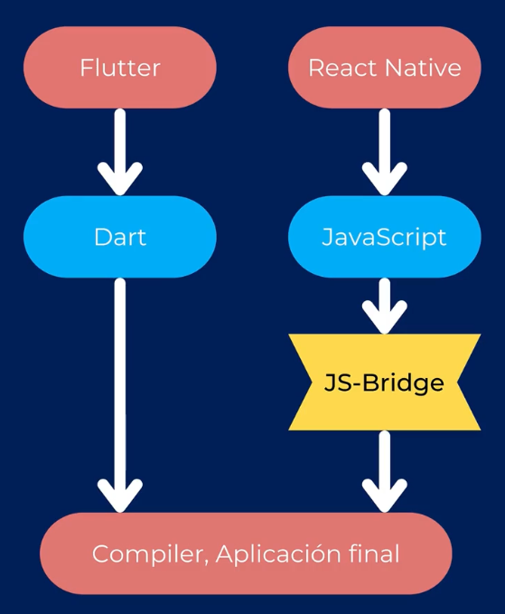

# DART

Repaso del lenguaje Dart.

Para ver más a profundidad el lenguaje Dart, ir a mi Github: https://github.com/JoseManuelMunozManzano/Dart_Curso

## Temas de la sección

- Hola Mundo
- Tipos de datos
- Estructuras de colección de datos
- Tipos de parámetros
- Clases
- Diferentes constructores
- Getters y Setters
- Extends, Implements y Mixins
- Futures
- Streams
- Async, Async\* y Await
- Decoradores (@override)
- Y más...

## Qué es Dart

Es un lenguaje del lado del cliente creado por Google y optimizado para aplicaciones.

- Optimizado para el UI
- Permite el Hot Reload
- Rápido en todas las plataformas (ARM y x64)

Dart fue concebido para Flutter.

Características principales de Dart:

- Futures
- Async-Await
- código non-blocking
- Streams al abrirlo de la caja
- Toda aplicación de Dart ejecuta una función inicial llamada main(), que puede ser síncrona o asíncrona
  - void main() {}
- Sintaxis familiar: C#, Java, TypeScript
- Curva de aprendizaje muy baja

Cómo es posible que Flutter sea tan rápido? Comparado con React Native:



## Proyectos

Ejecutar cada proyecto de la siguiente manera:

```
dart --enable-asserts <nombreprograma.dart>
```

Se indica la bandera --enable-asserts para habilitar la validación de las aserciones.

- 01_hello_world.dart
- 02_tipos_variables.dart
- 03_map.dart
- 04_list_iterables_sets.dart
- 05_funciones_parametros.dart
- 06_parametros_con_nombre.dart
- 07_clases.dart
- 08_name_constructors.dart
- 09_getters_setters.dart
- 10_clases_abstractas_enumeraciones.dart
- 11_mixins.dart
  - Explicación de mixins: https://medium.com/flutter-community/dart-what-are-mixins-3a72344011f3
- 12_futures.dart
