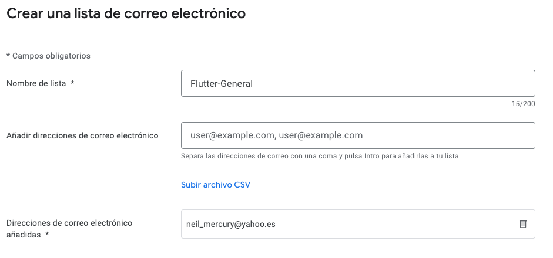
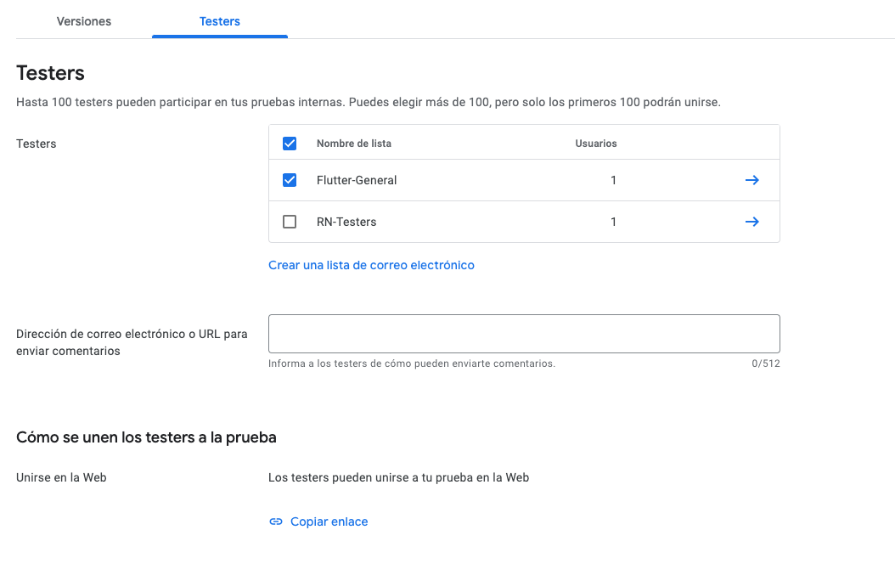

# Despligues a Play Store y Apple App Store

Esta sección está dedicada a la preparación y subida de nuestras aplicaciones a las tiendas (PlayStore y AppStore)

Puntualmente veremos:

- Renombrar app fácilmente y automáticamente
- Splash Screens
- Icono de la aplicación
- Android Developer Console
- Apple Developer Portal
- Alphas y Betas - Android
- TestFlight - Apple
- AAB - Application Bundle Android
- IPA - IOS
- Entre otras generalidades

El objetivo es poder subir la aplicación e iniciar el proceso de revisión y pruebas de múltiples usuarios sin necesidad de que ellos tengan cuentas de developer en las respectivas plataformas.

## Preparación del proyecto a subir

Para poder desplegar en la AppStore tenemos que hacer una app con cierto nivel de programación, es decir, si es una app muy facilona o para aprender sencillota, la AppStore lo va a saber y no nos va a dejar desplegarla.

Vamos a desplegar la app de `cinemapedia`.

Cargamos la app en VSCode y la probamos en el simulador de Android. Lo probamos primero aquí porque vamos a hacer la parte del despliegue primero en la PlayStore. Una vez esté ahí podemos hacer pruebas abiertas, pruebas cerradas, pasarlo o promover el proyecto a un release, ya de producción, y el procedimiento es muy transparente.

También hay un punto donde se pide que personalicemos el icono y el splash screen, porque si lo dejamos por defecto con el de Flutter va a ser rechazada en la AppStore (a lo mejor no en la PlayStore)

Otra cosa que vamos a tener que cambiar también, es, en la ruta `android/app/main/kotlin`, el budle de nuestra app, que ahora mismo es `com.example.cinemapedia`. Ese bundle id tenemos que cambiarlo porque probablemente ya esté tomado, aunque igualmente ese nombre de bundle id no vale. Durante la realización de las notificaciones push aprendimos a cambiar ese nombre manualmente, pero aquí lo vamos a hacer de una manera automática.

## Cambiar bundle id - App Id semi-automáticamente

Hay varios archivos dentro de la carpeta `android` donde aparece el bundle id por defecto `com.example.cinemapedia`. Como se ha indicado, este bundle id lo tenemos que cambiar si queremos que se puede desplegar en las tiendas sin problemas.

Se puede hacer manualmente, pero también hay otra forma de hacerlo que puede ser más práctica.

Instalamos este paquete `https://pub.dev/packages/change_app_package_name` como dependencia de desarrollo.

Y, para cambiar el nombre de la aplicación, hacer un commit por si algo saliera mal y ejecutar en la terminal:

```
flutter pub run change_app_package_name:main com.neimerc.cinemapedia
```

Es importante que este nombre sea único a nivel mundial.

Una vez ejecutado, salir de la app y volver a ejecutar desde cero, y, si todo funciona, volver a hacer otro commit.

## Cambiar iconos de la aplicación

Vamos a hacer el cambio del icono de nuestra app.

Ver `https://docs.flutter.dev/deployment/android#add-a-launcher-icon`

Todo esto se puede hacer manualmente, pero se puede usar el paquete `https://pub.dev/packages/flutter_launcher_icons` el cual nos ayuda a que, con un comando, ya genere todos los iconos que podamos necesitar, no solo para Android, también para la web, Windows, Mac, iOS... todo.

Instalamos el paquete `flutter_launcher_icons` como dependencia de desarrollo.

Este paquete admite bastante personalización.

En el archivo `pubspec.yaml` de nuestro proyecto creamos:

```
flutter_launcher_icons:
  android: "launcher_icon"
  ios: true
  image_path: "assets/icon/app-icon-2.png"
  min_sdk_android: 21
```

Y en `pubspec.yaml` en la parte `assets` indicamos:

```
  assets:
    - assets/icon/
```

Y en nuestro proyecto, en la carpeta `assets/icon` pegamos nuestros iconos.

Echamos abajo nuestra app.

Ejecutamos el siguiente comando para cambiar el icono de la app: `flutter pub run flutter_launcher_icons`.

Si todo va bien, podemos ir a `android/app/src/main/res` y ahí veremos que está nuestro icono en las distintas carpetas.

Volvemos a ejecutar nuestra app y deberíamos ver nuestro icono y un cambio en el splash screen (esto lo haremos mejor). Si minimizamos la app en el emulador, veremos nuestro nuevo icono.

NOTA: También, como recurso, tenemos esta web `https://www.bing.com/images/create` para crear iconos usando IA. Por ejemplo, se podría hacer la búsqueda `sales icon app`.

## SplashScreen

Esto no es obligatorio para hacer el deployment, pero la imagen de carga (SplashScreen) queda muy bonita cuando se personaliza. Además se puede hacer una pequeña animación y tenemos el control de cuando quitarlo, generalmente cuando la app ya se ha cargado y se puede ejecutar, pero podemos mantener el splashscreen hasta que un procedimiento que nosotros queramos termine.

Se puede personalizar modificando manualmente el archivo XML situado en `android/app/src/main/res/drawable-v21/launch_background.xml`, pero también tenemos que hacerlos en iOS y es un engorro.

Por suerte, hay otra forma mejor de realizar esta configuración, usando el paquete `https://pub.dev/packages/flutter_native_splash`. Este paquete lo instalamos como una dependencia normal, ya que en su configuración podemos indicar cuándo queremos quitar este SplashScreen.

Para realizar la configuración, tal y como indica la web del paquete, se puede hacer en `pubspec.yaml` o, mucho mejor si necesitamos hacer mucha configuración, crear en la raiz del proyecto el archivo `flutter_native_splash.yaml`.

Como mi ejemplo es pequeño, lo hago en `pubspec.yaml`.

```
flutter_native_splash:
  color: '#252829'
```

Detengo la app.

Y luego ejecutamos en la terminal: `dart run flutter_native_splash:create`.

Ejecutamos de nuevo la app.

## Android - Llaves de Release y Upload

Vamos a generar la versión de producción de la aplicación para Android.

Documentación: `https://docs.flutter.dev/deployment/android`

Tenemos que crearnos un `keystore` que es una firma que va a asegurar que en las próximas releases de la aplicación, es la misma persona la que está generándola.

Hay dos formas de generarla, una usando `Android Studio` o usando una `keytool`. De cualquiera de las dos formas vamos a obtener un fichero llamado `upload-keystore.jks` y tenemos que tener mucho cuidado con este archivo porque si lo perdemos no podremos hacer actualizaciones de la app.

El comando a ejecutar (no hace falta estar ni en la carpeta del proyecto) es:

```
keytool -genkey -v -keystore ~/upload-keystore.jks -keyalg RSA \
        -keysize 2048 -validity 10000 -alias upload
```

Nos pide una contraseña e indico: xxxxxxxxx (mínimo 6 números)
Nos pide nombre y apellido e indico: José Manuel Muñoz Manzano
Nos pide el nombre de su unidad de organización e indico: Neimerc
Nos pide el nombre de su organización e indico: Neimerc
Nos pide el nombre de su ciudad o localidad e indico: Madrid
Nos pide el nombre de su estado o provincia e indico: Madrid
Nos pide el código de país de dos letras de la unidad e indico: es
Nos pregunta si todo está correcto e indico: si (yes si el Sistema Operativo está en inglés)

Y vemos que el archivo lo genera en la carpeta root del usuario, en concreto `Almacenando /Users/jmmm/upload-keystore.jks`

Al archivo le cambio el nombre, para ser ordenado, a `cinemapedia.jks`.

Ahora creamos la referencia a esa llave.

Tal y como indica la documentación, tenemos que crearnos en nuestro proyecto de Android, en la carpeta `android`, un archivo llamado `key.properties`, el cual va a contener la información de la llave generada. Este archivo no se sube (mismo trato que archivo .env) y de hecho ya esta excluido automáticamente en `.gitignore`.

El contenido de ese archivo `key.properties` es este:

```
storePassword=<password-from-previous-step>
keyPassword=<password-from-previous-step>
keyAlias=upload
storeFile=<keystore-file-location>
```

Hay que hacer ahora la configuración del signing in gradle. Esto consiste en decirle que use esa llave que también creamos para hacer la generación de nuestra aplicación. Para esto:

1. Abrir el archivo `android/add/build.gradle`. Tenemos que añadir la información del keystore donde indica la documentación.

```
def keystoreProperties = new Properties()
def keystorePropertiesFile = rootProject.file('key.properties')
if (keystorePropertiesFile.exists()) {
    keystoreProperties.load(new FileInputStream(keystorePropertiesFile))
}

android {
  ...
}
```

2. Buscamos la parte del buildTypes y añadimos/modificamos de la siguiente forma:

```
    signingConfigs {
        release {
            keyAlias keystoreProperties['keyAlias']
            keyPassword keystoreProperties['keyPassword']
            storeFile keystoreProperties['storeFile'] ? file(keystoreProperties['storeFile']) : null
            storePassword keystoreProperties['storePassword']
        }
    }

    buildTypes {
        release {
            // TODO: Add your own signing config for the release build.
            // Signing with the debug keys for now, so `flutter run --release` works.
            signingConfig signingConfigs.release
        }
    }
```

3. La ofuscación de código es un paso opcional a la hora de hacer la APK o AAB, donde esta última es la que se recomienda hacer ya que el Application Bundle genera versiones específicas para quien lo ejecuta, lo que lo hace más liviano que APK, que hace versiones de todo y es más pesado.

4. Habilitar multidex, sirve para habilitar retrocompatibilidad con dispositivos muy viejos. También es opcional.

5. El review del manifest si hay que hacerlo. Uno importante es que, si tenemos una aplicación que usa Internet, hay que asegurarse de que tengamos puesto el permiso de Internet (android.permission.INTERNET) Modificamos `android/app/src/main/AndroidManifest.xml` y añadimos `<uses-permission android:name="android.permission.INTERNET"/>`

6. Revisar la configuración de Gradle. Aparecen versiones y sugerencias.

7. Building the app for release. Queremos crear el AAB (app bundle) que es la opción preferida. Esto lo hacemos en el siguiente punto.

## Android - Crear el App Bundle

En la terminal, nos situamos en la carpeta del proyecto y vamos a ejecutar `flutter build appbundle` para crear dicho app bundle. Este proceso verifica los archivos, usa las llaves y ejecuta todo el proceso de construcción para el bundleRelease.

Como indica la documentación, por defecto el app bundle se crea en `build/app/outputs/bundle/release/app-release.aab`. Vemos que el archivo pesa 25MB, que puede parecer mucho, pero ahí está el release para dispositivos de 32 bits, 64 bits y ARM64.

Nos vamos a esa ruta y nos llevamos ese fichero a otra ruta. En mi caso lo llevo a una carpeta `releases` que está dentro de la carpeta `Flutter`, pero fuera de los cursos realizados.

La parte de `Test the app bundle` la vamos a hacer `Online using Google Play` donde en un canal alfa la subida es casi instantantea, sin periodo de revisión. Esto es solo para probar el bundle, pero es recomendable siempre crear un alpha para probar la app antes de que pase al test run de los beta testers y sucesivas revisiones hasta el release final.

Esta es la documentación: `https://developer.android.com/studio/publish/upload-bundle`.

Y por fin, la PlayStore `https://play.google.com/console/u/0/signup`.

En la próxima clase vamos a subir esta app para poder probarla en nuestro dispositivo físico ya como release, sin tener que tener el teléfono conectado ni el build de Flutter.

## Android - Google Play Console

En la consola de Google Play vamos a hacer click en el botón `Crear aplicación`.

Llenamos la ficha de esa app. Esto es lo mínimo necesario, y hay que rellenar otros formularios cuando queramos pasar a otro tipo de pruebas o ya a producción. El orden es `alpha - beta - producción`.

Al pulsar de nuevo `Crear Aplicación` vamos a un panel (un dashboard) para configurar la app. Pulsamos, en el menú lateral izquierdo donde indica `Pruebas / Prueba interna`. La prueba interna es una prueba cerrada hasta un máximo de 100 verificadores.

El orden sería:

- Prueba interna de desarrolladores de la app, para probar que vaya bien en nuestros dispositivos
- Si todo sale bien, se promueve a una prueba cerrada, en la cual ya podemos invitar a otras personas a que prueben nuestra app. Si somos freelance, aquí podemos invitar a la persona que nos contrató para que pruebe la app
- Si todo sale bien, se promueve a una prueba abierta, que ya es para un número más grande de personas (1000 o 2000) para que nos den feedback

En la pantalla de `Prueba interna`, al final de la misma pulsamos en `Crear nueva versión`.

Nos lleva a una pantalla donde tendremos que dejar caer el fichero `app-release.aab` generado al crear el app bundle. Esto va a subir la aplicación, va a verificar las firmas y que todo esté bien, y, si todo va bien, tendremos nuestra app lista para probar.


Pulsamos el botón Siguiente.

Nos pueden salir ciertas advertencias o errores. Algunas advertencias se solucionan más adelante.

Pulsamos `Guardar y publicar`. Nos aparece un pop-up de confirmación y confirmamos.


Ahora hay que registrar a alguien para que haga la prueba. Nos vamos a la pestaña `Testers` (ver imagen de arriba) Aquí se pueden crear listas, por ejemplo, `Noticias Testers`, `Testers de Objetivos`, `ReactNative - Testers`...

Nos creamos un nuevo listado. Para ello pulsamos en `Crear una lista de correo electrónico`.



Pulsamos `Guardar cambios`.

Volvemos a la pantalla de Prueba Interna Publicada. Hacemos check en `Flutter-General` y pulsamos `Guardar`.

Eso nos genera un vínculo:



Si pulsamos para `Copiar enlace` y pegamos la URL en un navegador, nos sale la web para aceptar la invitación a ser tester. También puede lanzar correos electrónicos.


Pulsamos el botón `Accept Invite`.

Aparece otra ventana para descargar la app


La pulsamos y nos lleva a la página (unreviewed) de la app, y podemos instalarla en nuestro dispositivo de forma remota.

Esto puede tardar un rato en aparecer, indicando mientras tanto que no encuentra la url. Esperar.

## Android - Google Play Console - Generalidades

De nuevo en la pantalla principal de la Play Console, donde nos aparecen todas las apps que tenemos, pulsamos en nuestra app de `Cinemapedia`. Entramos al dashboard administrativo, y, en el menú lateral de la izquierda, volvemos a pulsar `Prueba interna`.

Una vez estemos satisfechos con las pruebas (si hemos tenido que actualizar por corregir errores se hace sin problemas desde aquí) podemos pulsar en `Promocionar version` para pasar a pruebas cerradas y luego abiertas, y, por último, producción para pasarla oficialmente a la PlayStore. Lo ideal es no saltarse ningún paso para asegurarnos que la app funciona de la manera esperada en diferentes dispositivos.

Antes de pasar a producción, en el menú lateral de la izquierda, buscamos `Crecimiento / Ficha de Play Store principal`, donde habrá que rellenar el formulario.

Las `Fichas personalizadas de Play Store` son opcionales, pero ayuda a que se vea más profesional.

Lo ideal es pasar por cada una de las opciones de `Crecimiento` y rellenar todos los formularios.

Es útil buscar en la Play Store como lucen distintas apps, para hacerlo parecido.

Una vez hecho todo esto, hay un proceso de revisión de la Google Play, que es bastante rápido.
