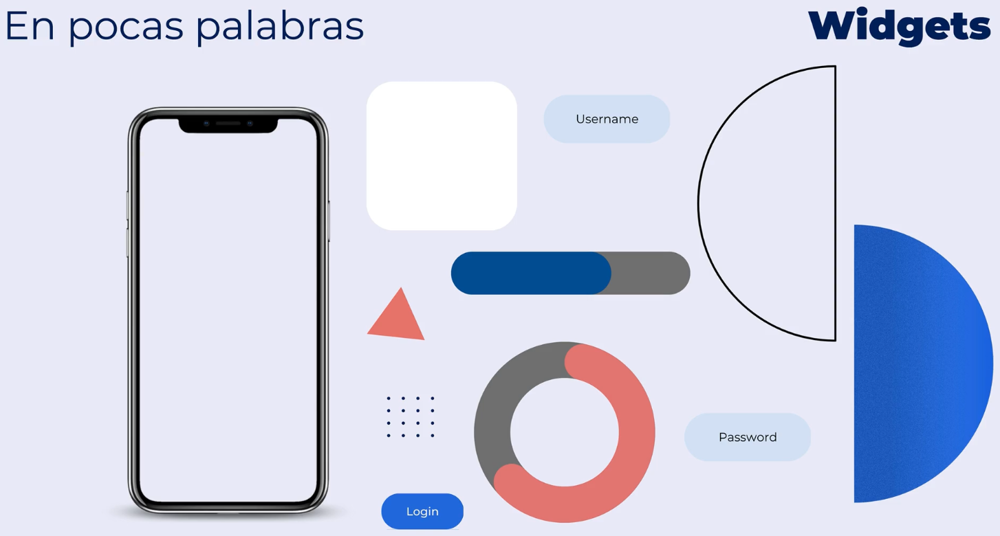
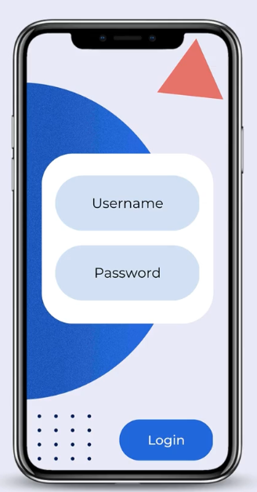
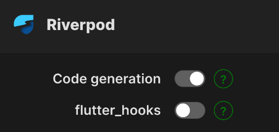
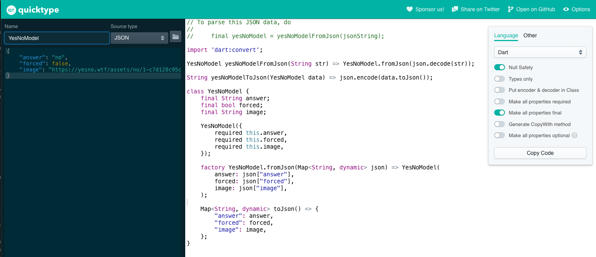

# FLUTTER - MOVIL: DE CERO A EXPERTO

Del curso de Fernando Herrera:

https://cursos.devtalles.com/courses/take/flutter-movil-cero-a-experto/lessons/42480509-instalaciones-necesarias-menos-flutter

## Instalaciones necesarias del curso

https://gist.github.com/Klerith/2917b2a21ea9c4bfa5d1070c89a89ec7

## Cheat sheets

[Dart Cheat Seet](./Cheat-sheet/dart-cheat-sheet.pdf)

[Flutter Cheat Seet](./Cheat-sheet/flutter-cheat-sheet.pdf)

- Para que se vean unas flechas que conectan los distintos child en VSCode, ir a la configuración de usuario:

```
  "dart.previewFlutterUiGuides": true,
  "dart.previewFlutterUiGuidesCustomTracking": true
```

## Documentación

- Documentación de material para Flutter: https://m3.material.io/develop/flutter

- Apps responsive y adaptativas:

  - https://docs.flutter.dev/ui/layout/responsive/adaptive-responsive
  - https://pub.dev/packages/responsive_framework
  - https://www.browserstack.com/guide/make-flutter-app-responsive
  - https://inveritasoft.com/blog/how-to-build-responsive-apps-with-flutter-widgets-review
  - https://hackernoon.com/creating-responsive-flutter-app-layouts-for-all-screen-sizes
  - https://dev.to/dariodigregorio/building-responsive-uis-in-flutter-a-short-guide-5871
  - https://dev.to/dariodigregorio/mastering-responsive-uis-in-flutter-the-full-guide-3g6i

- Integrar YouTube Video Player en una app Flutter: https://dev.to/gunkev/how-to-integrate-youtube-video-player-in-a-flutter-application-4hil?mc_cid=00dcad088a&mc_eid=c9accb49be

- Bolitas de los Slides para saber cuantos hay: https://api.flutter.dev/flutter/material/TabPageSelector-class.html

- Documentación DDD (Domain Driven Design):

  - https://medium.com/ssense-tech/domain-driven-design-everything-you-always-wanted-to-know-about-it-but-were-afraid-to-ask-a85e7b74497a
  - https://medium.com/bimar-teknoloji/understanding-clean-architecture-and-domain-driven-design-ddd-24e89caabc40

- Offline App con Flutter y SQLite: https://walkingtree.tech/make-your-apps-available-offline-using-flutter-and-sqlite/

- Carrusel: https://pub.dev/packages/card_swiper

- Staggered Grid View: https://pub.dev/packages/flutter_staggered_grid_view

- BottomNavigationBar: https://www.youtube.com/watch?v=HB5WMcxAmQQ

- HumanFormats - Números cortos: https://pub.dev/packages/intl

- Manejo de errores: https://docs.flutter.dev/testing/errors, https://docs.flutter.dev/cookbook/maintenance/error-reporting

- Clean Architecture con GetX: https://dev.to/ahmaddarwesh/flutter-getx-clean-architecture-4ppk

- Notificaciones accionables: https://pub.dev/packages/awesome_notifications

- FlutterFire: https://firebase.flutter.dev/docs/messaging/notifications/

- Paquete `permission_handler` para configurar cualquier permiso que necesite nuestra app: https://pub.dev/packages/permission_handler

- Internacionalización
  - https://docs.flutter.dev/ui/accessibility-and-internationalization/internationalization
  - https://www.kodeco.com/books/real-world-flutter-by-tutorials/v1.0/chapters/9-internationalizing-localizing
  - Si se usa el context para obtener traducciones, ocuparemos algún tipo de service locator para ello como get_it
- Local Databases
  - Isar. Muy poderoso y recomendado. Funciona en la web con IndexedDB. Es NoSQL, los objetos acaban siendo grabados como mapas (key-value pair): https://isar.dev/es/
  - HiveDB. Muy sencillote. Funciona en la web con IndexedDB. Es NoSQL, los objetos acaban siendo grabados como mapas (key-value pair): https://docs.hivedb.dev/#/
  - SQLite. Hay que crear mucho código y, algo bueno, genera un fichero con el contenido de la BBDD en el dispositivo. Como malo, no funciona en el navegador Web. Es una BBDD relacional tradicional: https://docs.flutter.dev/cookbook/persistence/sqlite
- Databases en la nube
  - Firebase. También tiene una opción para trabajar en local: https://firebase.google.com/docs/flutter/setup?platform=ios&hl=es
- Información local
  - Shared Preferences. No es BBDD local, pero si información local: https://pub.dev/packages/shared_preferences

## Recursos gratuitos

https://undraw.co/illustrations

https://www.freepik.es/

https://www.flaticon.com/

https://picsum.photos/

## Qué es Flutter

SDK portable - Open source framework - UI Widget Library

Sirve para crear hermosas aplicaciones compiladas de forma nativa, multi-plataforma con un único código base.

Está fuertemente inspirado en React, en el sentido es que este reutiliza componentes, llamados Widgets en Flutter.

Un Widget no es más que un objeto o una clase reutilizable que tiene cierta apariencia.

Con Flutter tenemos el control de cada pixel en pantalla.





Podemos usar widgets ya creados, pero también podemos crear nuestros propios widgets.

Existe un repositorio llamado `Pub.dev` donde podemos empaquetar nuestros widgets y subirlos.

Con Flutter podemos (independientemente de que se recomiende o no por temas de mantenimiento del software) crear apps para:

- Web
- Windows, Linux y Mac
- IOS, Android
- Sistemas embebidos (Google Nest...)

Todo con una sola base de código.

Hay tres partes en Flutter:

- La construcción de la lógica de negocio
- La conexión de la lógica de negocio y nuestros Widgets
- La creación del diseño de la aplicación

## Borrar y generar dependencias

Usando la terminal y en la raiz del proyecto, ejecutar:

- flutter clean
- flutter pub get

## Variables de entorno

Creamos en la raiz del proyecto el archivo `.env` y ahí indicamos nuestras variables de entorno.

Flutter no sabe de la existencia del archivo `.env` y no los maneja por defecto. Tenemos que configurarlo.

Hay muchos paquetes que sirven para manejar los archivos de variables de entorno.

Vamos a usar: https://pub.dev/packages/flutter_dotenv

En esa URL puede verse la documentación para configurarlo en nuestra app de Flutter.

Y no olvidar, a la hora de hacer commits en Git, añadir este fichero a `.gitignore` y crear un fichero `.env.template` indicando los nombres (sin las claves) de las variables de entorno que necesitamos.

## Settings de VSCode

Al iniciar algún proyecto de Flutter, crear la carpeta `.vscode` en la raiz y dentro un archivo `settings.json` el cual contiene:

```
{
  "editor.codeActionsOnSave": {
    "source.fixAll": true,
    "quickfix.insertSemicolon": true,
  }
}
```

Esto ayuda a agregar la palabra `const` en donde debe sin tener que agregarlo manualmente quitar importaciones innecesarias y añadir punto y coma al guardar nuestros cambios.

## Trabajar con los colores indicados en el seed

Para no tener que hardcodear colores en cada Widget.

Lo que se hace es indicar en `main.dart` la paleta de colores: `theme: AppTheme(selectedColor: 1).theme(),`

Y luego en cada Widget donde necesitemos acceso a la paleta accedemos al contexto: `final colors = Theme.of(context).colorScheme;`

Y para usarlo en un Widet Decoration, por ejemplo un color primario en función de nuestra paleta de colores:

```
decoration: BoxDecoration(
   color: colors.primary, borderRadius: BorderRadius.circular(20)
)
```

## Obtener dimensiones del dispositivo

El MediaQuery nos va a dar información respecto al dispositivo que lo está ejecutando.

El context hace referencia al árbol de Widgets, donde también tenemos otra información como las dimensiones y características del dispositivo donde se está ejecutando la app.

Usando size obtenemos las dimensiones del dispositivo.

`final size = MediaQuery.of(context).size;`

Y para usarlo en una imagen:

```
child: Image.network(
    'https://yesno.wtf/assets/no/1-c7d128c95c1740ec76e120146c870f0b.gif',
    width: size.width * 0.7,
    // La idea de dejar un height específico, es para evitar que las imágenes
    // varíen unas de otras. Siempre voy a saber su alto.
    height: 150
)
```

## Mostrar mensaje mientras se carga la imagen

Usamos `loadingBuilder` dentro de nuestro Widget `Image`

Recordar que un Builder es algo que se va a construir en tiempo de ejecución.

El child es nuestra misma imagen cuando se carga, ya construida enteramente.

El context es nuestro árbol de Widgets e info del dispositivo.

```
loadingBuilder: (context, child, loadingProgress) {
  // Si se cargo por completo, regresa la imagen
  if (loadingProgress == null) return child;

  // Indicando el mismo size se evitan brincos en el diseño cuando pasamos del loader a la imagen.
  return Container(
    width: size.width * 0.7,
    height: 150,
    padding: const EdgeInsets.symmetric(horizontal: 10, vertical: 5),
    child: const Text('Se está enviando una imagen'),
  );
```

## Recibir lo que la persona escribe

Se puede hacer de las siguientes maneras (puede haber más)

```
// El texto completo, obtenido al pulsar Enter.
onFieldSubmitted: (value) {
  print('Submit value $value');
},

// Cada valor de la tecla pulsada.
onChanged: (value) {
  print('changed: $value');
},
```

## Obtener control de un input

Con este elemento obtenemos el control del input al que se asocia.

`final textController = TextEditingController();`

```
return TextFormField(
  // Para asociarlo
  controller: textController,

  // Y para usarlo, por ejemplo para limpiar un input de texto cuando hemos pulsado enter (en este caso, por ser onFieldSubmitted):
  onFieldSubmitted: (value) {
    textController.clear();
  },
);
```

Y si estamos en otro sitio, pero relacionado, y queremos obtener el texto del input:

```
suffixIcon: IconButton(
  icon: const Icon(Icons.send_outlined),
  onPressed: () {

    // Usamos esto
    final textValue = textController.value.text;

    print('button: $textValue');

    // Y para limpiar el texto
    textController.clear();
  },
);
```

## Mantener el foco

Cuando un elemento necesita un foco, se puede hacer de la siguiente manera:

`final focusNode = FocusNode();`

Y para usarlo:

```
return TextFormField(
  // Al hacer click fuera del input se va a remover el foco
  onTapOutside: (event) {
    focusNode.unfocus();
  },

  // Indicamos que tiene el foco.
  focusNode: focusNode,

  onFieldSubmitted: (value) {
    print('Submit value $value');
    textController.clear();

    // Lo usamos para mantener el foco una vez se ha pulsado Enter.
    focusNode.requestFocus();
  },
);
```

## Instalar y usar Provider

Ir a la ruta: https://pub.dev/packages/provider

Algo que tenemos que tener en cuenta a la hora de instalar un paquete es la plataforma (PLATFORM) Para el paquete provider, vemos que las plataformas posibles son Android, iOS, Linux, MacOs, Web y Windows. Pero no todos los paquetes funcionan para todas las plataformas.

Otra cosa que tenemos que tener en cuenta a la hora de instalar un paquete es la versión de Dart para la que el paquete está disponible. En el caso de Provider, indica `Dart 3 compatible`.

Para instalar:

- Pulsar Installing
  - Ahí nos indica como instalar el paquete

Formas de instalar paquetes:

- Forma 1
  - Ir al terminal, a la raiz del proyecto y ejecutar: `flutter pub add provider`.
  - Podemos ver donde se han instalado todos esos paquetes. Para ello abrir el archivo `pubspec.yaml` y bajar hasta ver `dependencies`
- Forma 2
  - Abrir el fichero `pubspec.yaml`, bajar hasta dependencias y escribir: `provider: ^6.1.2`
  - Grabar el archivo o, en VSCode, pulsar la flecha hacia abajo, donde indica `Get Packages`
- Forma 3
  - Si, en VSCode hemos instalado el plugin `Pubspec Assist`
    - Pulsar Cmd+Shift+P y escribir pubassist
    - Seleccionar `Pubspec Assist: Add/update dependencies`
    - Escribir el nombre del paquete `provider`

Siempre que instalemos un paquete, deberíamos revisar si hay que tener en cuenta algo para que funcione en iOS, Android, Web...

Envolver archivo `main.dart` con nuestro Provider para crear un provider a nivel global de nuestra aplicación:

- Situarnos sobre MaterialApp y pulsar Cmd+.
- Pulsar sobre Wrap with widget...
- Cambiar el nombre a `MultiProvider`
- Indicar el listado de providers. En nuestra app, como tenemos un provider que se encarga de notificar cuando hay cambios (ChangeNotifier), el provider que indicaremos es `ChangeNotifierProvider`, y este tiene una propiedad `create` que espera que hagamos la creación de la instancia inicial, que es `ChatProvider()`
  - Por defecto, el comportamiento natural de los Change NotifierProvider es que, hasta que no sea necesario, Provider NO creará la instancia. Es decir, por defecto son cargados de manera perezosa. Indicando la propiedad lazy en false, evitamos esa carga perezosa y, por tanto, se crea la intancia: `lazy: false,` Puede ser conveniente cuando sabemos que hay una carga asíncrona de data que el usuario siempre va a necesitar.

```
@override
Widget build(BuildContext context) {
  return MultiProvider(
    providers: [
      // Si queremos que se cree la instancia.
      // lazy: false,
      // El argumento es el context, pero si no se va a usar se suele indicar _
      ChangeNotifierProvider(create: (_) => ChatProvider())
    ],
    child: MaterialApp(
      ...
    ),
  );
}
```

Al grabar el archivo veremos ahora en la barra de debug de VSCode un icono Flutter de DevTools.

Si lo pulsamos veremos la estructura del BuildContext.

Contra de usar Provider: No permite dos instancias de la misma clase.

## Leer un valor del Provider

De nuevo, ir a la web: https://pub.dev/packages/provider#reading-a-value y leer la documentación.

La forma más fácil de leer un valor es usar las siguientes extensiones del BuildContext:

- context.watch<T>() : el Widget escucha los cambios sobre T (siendo T el provider especificado) y redibuja
- context.read<T>() : regresa el provider sin escuchar los cambios, es decir, no redibuja
- context.select<T, R>(R cb(T value)) : solo se notifica al Widget cuando alguna propiedad concreta del provider cambia
- Provider.of<T>(context, listen: false) : similar a context.read<T>()

Ejemplo en archivo `chat_screen.dart`

```
class _ChatView extends StatelessWidget {
  @override
  Widget build(BuildContext context) {
    // Hacemos la referencia al provider, indicando la instancia del MultiProvider que necesito, que es ChatProvider.
    final chatProvider = context.watch<ChatProvider>();

    // Otra forma más antigua de hacer lo mismo de arriba es:
    // final otroProvider = Provider.of<DiscoverProvider>(context);
    //
    // Y si solo quisiéramos escuchar
    // final otroProvider = Provider.of<DiscoverProvider>(context, listen: false);

    return SafeArea(
      ...
    )
  }
}
```

El código `final chatProvider = context.watch<ChatProvider>();` es muy parecido a este que aparece más arriba para obtener información del context `final colors = Theme.of(context).colorScheme;`

## Riverpod

Documentación:

- https://riverpod.dev/

Riverpod sirve para manejar el estado de la aplicación, ya sea global, por widget, por pantalla...

A diferencia de Provider, Riverpod NO depende del context.

Se considera a Riverpod como el sucesor de Provider.

Hay dos versiones de Riverpod (ver siguiente punto) y aquí vemos la versión 1 que no está obsoleta.

Riverpod trabaja con providers (no confundir con el gestor de estado Provider), que son proveedores de información, y hay casos específicos para cada uno de ellos.

Existen los paquetes flutter_riverpod para Flutter y riverpod para Dart.

Nosotros vamos a usar el paquete `flutter_riverpod`.

Para empezar a trabajar (revisar siempre la documentación primero):

- En VSCode abrimos Pubspec Assist e instalamos `flutter_riverpod`
- En `main.dart`, en `runApp()` envolvemos todo con un `ProviderScope()`
  - ProviderScope es un tipo de Widget especial que va a mantener una referencia a todos los providers que utilicemos
- A partir de aquí ya se puede empezar a trabajar. Se puede ver ejemplos en la app `widgets_app`, carpeta `presentation/providers`, que se usan en `presentation/screens/counter/counter_screen.dart`

Uno de los beneficios de usar Riverpod es que permite crear dos instancias de la misma clase (ver proyecto cinemapedia)

### Riverpod - StateNotifier

La diferencia principal con un StateProvider, es que StateProvider lo usamos para un state "básico", básicamente un Boolean, Integer o String.

Cuando necesitemos trabajar con un state mas complejo, ya sea un objeto, una lista, un map... ahí usaremos StateNotifierProvider.

Tanto en isDarkModeProvider como en selectedColorProvider estamos manejando un boolean y un int, por lo que perfectamente podemos usar un StateProvider.

Ahora, en themeNotifierProvider vamos a manejar un objeto, por lo que ahí tenemos que usar StateNotifierProvider.

https://dhruvnakum.xyz/flutter-riverpod-stateprovider-statenotifier-statenotifierprovider-futureprovider-streamprovider

### Riverpod Annotations y generador de código

Riverpod no hace mucho lanzó una nueva sintaxis.

No marca como obsoleta la anterior sintaxis, lo que significa que ahora tenemos dos formas de usarlo.

La nueva versión utiliza decoradores y anotaciones que ayudan al generador de código a crear el provider ideal para lo que queremos hacer.

Tiene pros y contras esta nueva versión de código:

- Pros:
  - Es la forma recomendada por Riverpod
  - Sintaxis mucho más simple
  - Determina automáticamente el provider acorde a la necesidad
- Cons:
  - Hay que mantener un watch o ejecutar el generador en cada cambio que hagamos en los providers: `flutter pub run build_runner watch`
  - Un paquete adicional de `riverpod_generator` como dependencia de desarrollo (que realmente no es gran problema)

Pueden ver los ejercicios de una u otra sintaxis con el switch que colocaron en el sitio web de Riverpod.



Pueden experimentar ambas sintaxis, y trabajar con la que más les guste. Pueden leer más al respecto aquí

https://docs-v2.riverpod.dev/docs/concepts/about_code_generation

## Cambiar variables final de una clase

Este patrón se usa muchísimo en Flutter.

Ver app `widgets_app`, fuente `app_theme.dart`.

```
// La idea de este método es regresar una nueva instancia de AppTheme.
// La idea es hacer una copia del tema actual (instacia) que fluirá por toda la aplicación.
// To-do lo que se pida será opcional.
// Forma de uso, por ejemplo en main.dart
//   ThemeData.dark().copyWith( incluir aquí las opciones que quiero cambiar);

AppTheme copyWith({
  int? selectedColor,
  bool? isDarkMode,
}) => AppTheme(
  // Si no me mandan nada, utilizo el valor de la instancia anterior.
  selectedColor: selectedColor ?? this.selectedColor,
  isDarkMode: isDarkMode ?? this.isDarkMode,
);
```

## Truco para que Flutter tarde en hacer una animación

Da la sensación de que se procesa y se hace.

Y también corrige un bug. El provider notifica a los listeners que hubo un cambio pero no le da el tiempo suficiente para que se redibuje la UI y el scrollController se actualize. Con este delay damos ese tiempo.

```
  // Indicamos async y que haga un delayed
  Future<void> moveScrollToBotton() async {
    await Future.delayed(const Duration(milliseconds: 100));

    // Y aquí lo que queramos que haga.
  }
```

## Petición HTTP

Aunque se puede hacer una petición HTTP directamente con Dart, es necesario mucho código.
Al final vamos a acabar usando uno de dos paquetes:

- http: https://pub.dev/packages/http
- dio: https://pub.dev/packages/dio

Para instalar dio:

- Pulsar, en VSCode, `Cmd+Shift+P`
- Seleccionar `Pubspec Assist: Add/update dependencies`
- Escribir el nombre del paquete `dio`

Dio es muy fácil de usar e incluso hace la serialización del mapa por nosotros.

```
class GetYesNoAnswer {
  // Con Dio podemos usar las BaseOptions, que nos permite indicar la base de la url, queryParameters, headers y muchísimas más cosas (ver proyecto cinemapedia)
  // final _dio = Dio(BaseOptions(
  //   baseUrl:
  // ));

  final _dio = Dio();

  Future<Message> getAnswer() async {
    final response = await _dio.get('https://yesno.wtf/api');

    // Forma sencilla de devolver lo que queremos, pero sin usar Mappers
    return Message(
      text: response.data['answer'],
      fromWho: FromWho.hers,
      imageUrl: response.data['image'],
    );
  }
}
```

## Mappers

En Dart es muy usual crear, para las respuestas de los API, una clase para recibir la respuesta y crear una instancia para poder acceder a sus valores con la notación de punto en vez de con las llaves, como en el ejemplo de arriba. Así evitamos equivocaciones y que el código sea volatil (que cambien el nombre de una propiedad de la respuesta).

El objetivo es, con la respuesta HTTP, crear un Mapper.

Ejemplo de Mapper:

```
// El objetivo de esta clase es tener todas las propiedades que vienen en la response HTTP.
// Es como crearse una adaptación específica de la respuesta.
class YesNoModel {
  String answer;
  bool forced;
  String image;

  YesNoModel({
    required this.answer,
    required this.forced,
    required this.image,
  });

  // Una vez creada esta clase, nos falta recibir un mapa y con ese mapa crear una instancia de esta clase.
  // Aquí tenemos para ello este Factory Constructor.
  factory YesNoModel.fromJsonMap(Map<String, dynamic> json) =>
      YesNoModel(
        // Y luego, de este mapa tendríamos que evaluar que propiedades son las que ocupamos.
        // Con esto ya podemos usar notación de punto para evitar equivocarme al escribir.
        answer: json['answer'],
        forced: json['forced'],
        image: json['image']
    );
}
```

Y ahora la gestión de la respuesta HTTP cambia a:

```
class GetYesNoAnswer {
  final _dio = Dio();

  Future<Message> getAnswer() async {
    final response = await _dio.get('https://yesno.wtf/api');

    final yesNoModel = YesNoModel.fromJsonMap(response.data);

    // Podemos usar notación de punto.
    return Message(
      text: yesNoModel.answer,
      fromWho: FromWho.hers,
      imageUrl: yesNoModel.image,
    );
  }
}
```

Notar que es muy fácil generar este Mapper porque son 3 campos.
Podemos usar la extensión de VSCode `Paste JSON as Code` o ir a la web: `https://quicktype.io/`

En Postman hacer la petición a la API y copiar la respuesta.

En la web, seleccionar las opciones indicadas en la imagen y pegar la respuesta de Postman. Se ha cambiado el nombre del root a YesNoModel.



Y como vemos, genera el código automáticamente.

## Assets

En la carpeta raiz del proyecto creamos una carpeta `assets`, es decir, recursos estáticos, donde colocamos las carpetas con dichos recursos. Los recursos estáticos son parte de la app, es decir, irán en el bundle inicial de la aplicación y estarán disponibles directamente en la memoria del dispositivo.

Sin embargo, dichos recursos no van a estar disponibles en nuestra app hasta que lo indiquemos en el fichero `pubspec.yaml`, en la parte donde indica como añadir `assets` a la aplicación, y lo dejamos así.

```
  # To add assets to your application, add an assets section, like this:
  # Ojo!! Indentado! porque va dentro de flutter
flutter:
  assets:
    - assets/videos/
```

Tal y como lo hemos indicado, con `videos/` se importan todos los videos que se encuentren en esa carpeta, pero NO LOS SUBDIRECTORIOS. Si hubiera subdirectorios, hay que indicarlos.

Cuando se incluyen assets, se recomienda cerrar la app completamente y volverla a ejecutar.

## Cargar imágenes de Assets

`Image(image: AssetImage('assets/images/1.png'))`

O también vale: `Image.asset(...)`

## Operador de cascada

Lo vemos en el proyecto `toktik`.

En la parte `DiscoverProvider()..loadNextPage()`, a `..` se le llama operador de cascada.

```
  @override
  Widget build(BuildContext context) {
    return MultiProvider(
      providers: [ChangeNotifierProvider(create: (_) => DiscoverProvider()..loadNextPage())],
      child: MaterialApp(
        title: 'TokTik',
        debugShowCheckedModeBanner: false,
        theme: AppTheme().getTheme(),
        home: const DiscoverScreen()
      ),
    );
  }
```

Ejemplo sin cascada:

```
  myObject.someMethod();
  myObject.someOtherMethod();
```

Ejemplo con cascada:

```
  myObject
    ..someMethod();
    ..someOtherMethod();
```

Puede verse que sirve para evitar tener que estar haciendo referencia constante al objeto.

## PageView

Es un Widget que nos permite hacer scroll a pantalla completa. Similar a un listado.

Toma todo el espacio disponible en la pantalla o el espacio que se le esté asignando.

```
return PageView(
  // Por defecto el movimiento es horizontal.
  // Lo cambiamos para esta app a vertical.
  scrollDirection: Axis.vertical,
  // Para que funcione el scroll horizontal/vertical en Android.
  physics: const BouncingScrollPhysics(),
  // Para ir viendo estos colores, mover el ratón con el botón izquierdo pulsado en el dispositivo simulado, a la derecha
  // y a izquierda (o arriba y abajo en este caso), para que cambie de color.
  children: [
    Container(color: Colors.red),
    Container(color: Colors.blue),
    Container(color: Colors.teal),
    Container(color: Colors.yellow),
    Container(color: Colors.pink),
    Container(color: Colors.deepOrange),
  ],
);
```

Y dinámico, con ejemplo de Stack y Positioned:

```
// Con builder construimos el PageView bajo demanda.
// En vez de tener en children todo lo que queremos renderizar, solo tendremos lo que realmente
// necesitamos (dinámico) en un itemBuilder.
return PageView.builder(
  scrollDirection: Axis.vertical,
  physics: const BouncingScrollPhysics(),
  // Los elementos que tengo.
  itemCount: videos.length,
  itemBuilder: (context, index) {
    final VideoPost videoPost = videos[index];

    // Construimos un stack, que permite colocar sus hijos unos sobre otros. Esto nos permite
    // alinear y posionarlos en relación al espacio que les da el padre.
    // En el ejemplo tenemos tres Widgets: De fondo el video, un gradiente y botones de manejo.
    // Es decir, conforme más abajo aparece el Widget, más cerca de la pantalla se ve.
    //
    // Indicar que Column y Row se comportan como un Stack.
    return Stack(
      children: [
        // Video Player + gradiente

        // Botones
        // Por defecto, todos los Widgets se colocan en la posición 0,0 del dispositivo (arriba a la izquierda)
        // Para colocarlo en la posición que queramos, debemos envolver nuestro Widget en un Widget llamado Positioned.
        // Positioned trabaja junto al Stack y nos permite definir la posición del Widget hijo.
        Positioned(
          bottom: 40,
          right: 20,
          child: VideoButtons(video: videoPost)
        ),
      ],
    );
  } ,
);
```

## Positioned

Por defecto, todos los Widgets se colocan en la posición 0,0 del dispositivo (arriba a la izquierda)

Para colocarlo en la posición que queramos, debemos envolver nuestro Widget en un Widget llamado Positioned.

Positioned trabaja junto al Stack y nos permite definir la posición del Widget hijo.

```
Positioned(
  bottom: 40,
  right: 20,
  child: VideoButtons(video: videoPost)
),
```

## Formateo de números

Instalamos un paquete llamado `intl`.

Ejemplo de uso:

```
class HumanFormats {

  static String humanReadableNumber(double number) {

    final formattedNumber = NumberFormat.compactCurrency(
      decimalDigits: 0,
      symbol: '',
    ).format(number);

    return formattedNumber;
  }
}
```

## Truco para saber lo que ocupa un Widget en pantalla

Se suele usar `Placerholder()`, cuando veremos una X en el espacio reservado, o `Container(color: Colors.red)` y veremos ese color en el espacio reservado.

## Animaciones en Flutter

Instalamos un paquete llamado `animate_do`.

La web del paquete es: https://pub.dev/packages/animate_do

Y distintos videos de YouTube con la funcionalidad:

https://www.youtube.com/watch?v=48jIUnc1TQo&list=PLCKuOXG0bPi1E-uXVd4j2iLqkbTYaHARX&index=2

https://www.youtube.com/watch?v=oreOdtQ124M

https://www.youtube.com/watch?v=QLUI3Pxw1Z8

https://www.youtube.com/watch?v=w698MRVTB2E

## Video Player

https://docs.flutter.dev/cookbook/plugins/play-video

Para visualizar videos, instalamos el paquete `video_player`.

Siempre que instalemos un paquete, deberíamos revisar si hay que tener en cuenta algo para que funcione en iOS, Android, Web...

Por ejemplo, para cargar videos de Internet en Android, hay que añadir el siguiente permiso en `AndroidManifest.xml`

`<uses-permission android:name="android.permission.INTERNET"/>`

## Acceso a propiedades del StatefulWidget en la clase State.

Dado el StatefulWidget siguiente:

```
class FullScreenPlayer extends StatefulWidget {
  final String videoUrl;
  final String caption;

  const FullScreenPlayer({
    super.key,
    required
    this.videoUrl,
    required this.caption
  });

  @override
  State<FullScreenPlayer> createState() => _FullScreenPlayerState();
}
```

Y su estado, para poder acceder a una propiedad, como por ejemplo caption, usaremos widget.caption.

```
class _FullScreenPlayerState extends State<FullScreenPlayer> {
  @override
  Widget build(BuildContext context) {

    // Usamos widget para acceder a las propiedades del StatefulWidget.
    widget.caption;

    return const Placeholder();
  }
}
```

## Ciclos de Vida

Los StatelessWidgnet NO tienen ciclo de vida. Se crean siempre que haga falta.

Los StatefulWidget SI tienen ciclo de vida. Si hay que crear un listener o un controller hay que convertir el Widget a StatefulWidget.

Pasos del ciclo de vida:

- initState() - Creación del state. Siempre hay que ejecutar lo primero `super.initState();`
- dispose() - Cuando se destruye el Widget. Siempre hay que ejecutar lo último `super.dispose();`

Es buena práctica cuando colocamos un listener o se utiliza un controlador (controller) llamar al dispose().
Esto se hace para limpiar los listeners que no se estén utilizando y no gastar más memoria de la necesaria.

## GestureDetector()

Es un Widget que tiene muchas funciones incorporadas para tratar el tema de gestos sobre la pantalla, como pulsar, pellizcar...

Ejemplo:

```
return GestureDetector(

  // Si pulso en la pantalla entonces se pausa un video. Si vuelvo a pulsar se reproduce el video.
  onTap: () {
    if (controller.value.isPlaying) {
      controller.pause();
      return;
    }

    controller.play();
  },
  ...
);
```

## Gradiente

Ejemplo donde puede verse un BoxDecoration con un LinearGradient y algunas de las propiedades que espera.

```
// fill es parecido a un SizedBox, pero como vamos a estar dentro de un Stack, fill indica
// que se tome todo el espacio posible de ese Stack.
return Positioned.fill(
  child: DecoratedBox(
    decoration: BoxDecoration(
      gradient: LinearGradient(
        colors: [
          Colors.transparent,
          Colors.black87  // 87% negro y 13% transparente
        ],
        // Donde queremos que se detenga el gradiente.
        // El comportamiento por defecto del gradiente es [0.0, 1.0]
        //
        // Para este ejemplo [0.5, 1.0]
        // Indicando 0.5 decimos que sea transparente desde 0 hasta la mitad de la pantalla.
        // Podemos definir tantos stops como colores tenemos.
        stops: [0.5, 1.0],
        // Para indicar donde empieza el gradiente (apariencia) y donde acaba
        begin: Alignment.topCenter,
        end: Alignment.bottomCenter,
      )
    )
  )
);
```

## Navegación entre pantallas

https://docs.flutter.dev/ui/navigation

La navegación 2.0 de Flutter es bastante compleja.

Se muestra un ejemplo con `onTap()`, pero obviamente puede ser `onPressed: () {}` o cualquier otro gestor de eventos.

Se muestran distintas alternativas para realizar la navegación. Nosotros vamos a usar `go_router`.

El objetivo principal de go_router es que nos haga fácil y explicativo la manera de observar los argumentos por el URL, parametrizarlos, hacer validaciones, sacar al usuario si no está autenticado...

https://pub.dev/packages/go_router y pulsar en `API Reference`.

- Forma 1, propia de Flutter:

```
onTap: () {

  // push() hay que entenderlo como que va a crear un Stack de tarjetas.
  // Tengo una tarjeta, y con push() pongo encima otra y con push() pongo encima otra...
  // Y con pop() las voy retirando en sentido LIFO
  // Usando Navigator.of(context).replace() se destruye la ruta anterior, no podiendo regresar a ella.
  // Como ButtonsScreen tiene un AppBar sabe que tenemos un historial y podemos echar para atrás.

  Navigator.of(context).push(
    MaterialPageRoute(
      builder: (context) => const ButtonsScreen(),
    ),
  );
},
```

- Forma 2, propia de Flutter:

```
// En main.dart definimos las rutas.

return MaterialApp(
  debugShowCheckedModeBanner: false,
  theme: AppTheme(selectedColor: 0).getTheme(),
  home: const HomeScreen(),

  // Para la navegación, se pueden definir rutas, pero no se recomienda por una serie de limitantes.
  // Ver la web para saber las limitantes.
  // Al tener estos nombres de rutas la navegación se hace más fácil.
  routes: {
    '/buttons': (context) => const ButtonsScreen(),
    '/cards': (context) => const CardsScreen(),
  },

);

// En home_screen.dart accedemos a esas rutas.

onTap: () {

  // Y para usar los nombres de rutas:
  Navigator.pushNamed(context, menuItem.link);

  // Esta otra opción es posible:
  // Navigator.of(context).pushNamed(menuItem.link);
},
```

- Forma 3 recomendada, usando el paquete `go_router`:

- Instalar el paquete `go_router` usando `PubSpec Assist`
- Las rutas se crean con la misma sintaxis que se usa en programación web
- go_router expande la funcionalidad del context, por ejemplo, context.go(), por lo que podemos usar el context para la navegación
- Indicar que todo lo que es el `Navigator` de Flutter sigue funcionando
- En este ejemplo de usa el path para la navegación

```
// Fuente app_router.dart
// Código cogido de: https://pub.dev/documentation/go_router/latest/topics/Get%20started-topic.html
// y luego modificado.
import 'package:go_router/go_router.dart';
import 'package:widgets_app/presentation/screens/screens.dart';

final appRouter = GoRouter(
  initialLocation: '/',
  routes: [
    GoRoute(
      path: '/',
      builder: (context, state) => const HomeScreen(),
    ),

    GoRoute(
      path: '/buttons',
      builder: (context, state) => const ButtonsScreen(),
    ),

    GoRoute(
      path: '/cards',
      builder: (context, state) => const CardsScreen(),
    ),
  ],
);

// Se conecta en main.dart
// Se indica el router e indicamos su configuración
return MaterialApp.router(
  routerConfig: appRouter,

  debugShowCheckedModeBanner: false,
  theme: AppTheme(selectedColor: 0).getTheme(),
);

// Y en home_screen.dart
onTap: () {
  // go_router expande la funcionalidad del context, por ejemplo, context.go(), por lo que
  // podemos usar el context para la navegación.
  // NOTA: Indicar también que la funcionalidad Navigator.of(context).push() sigue funcionando.

  context.push(menuItem.link);
},

```

## go_router usando rutas con nombre

En vez del path, podemos usar rutas con nombre para realizar la navegación.

https://pub.dev/documentation/go_router/latest/topics/Named%20routes-topic.html

No es que sea mejor una que la otra, podemos usar navegación por `path` o por `name`, la que nos venga mejor.

Ejemplo:

```
// Fuente app_router.dart
import 'package:go_router/go_router.dart';
import 'package:widgets_app/presentation/screens/screens.dart';

final appRouter = GoRouter(
  initialLocation: '/',
  routes: [
    GoRoute(
      path: '/',

      // Indicando name, podemos hacer que la navegación sea por nombre.
      // Lo que se ha hecho es, en cada Screen, indicar una propiedad estática con el nombre.
      name: HomeScreen.name,

      builder: (context, state) => const HomeScreen(),
    ),

    ...
  ],
);

// En home_screen.dart
class HomeScreen extends StatelessWidget {

  // Esta propiedad estática y constante sirve para definir el nombre de la ruta en la navegación
  static const name = 'home_screen';

  ...
}

// Y en home_screen.dart, más abajo, en el onTap()
onTap: () {
  context.pushNamed(CardsScreen.name);
},

```

## Archivos de barril

Es un archivo que se encarga de exportar todos los archivos de diferentes carpetas, por ejemplo, todos los screens.

Con esto los archivos quedan separados, pero los cogemos de un único lugar, lo que disminuye las importaciones en otros fuentes.

Ejemplo:

```
export 'package:widgets_app/presentation/screens/buttons/buttons_screen.dart';
export 'package:widgets_app/presentation/screens/cards/cards_screen.dart';
export 'package:widgets_app/presentation/screens/home/home_screen.dart';
```

## Truco para saber cuánto ocupan los Widgets en pantalla

Envolver con un DecoratedBox y decorar con un color de fondo.

Por ejemplo:

```
return SizedBox(
  child: DecoratedBox(
    decoration: const BoxDecoration(color: Colors.green),

    child: Wrap(
      ...
    ),
  ),
);
```

## Botón personalizado

```
class CustomButton extends StatelessWidget {
  const CustomButton({super.key});

  @override
  Widget build(BuildContext context) {
    final colors = Theme.of(context).colorScheme;

    return Material(
      color: colors.primary,
      // Se puede usar este borderRadius o envolver Material en un Widget ClipRRect e indicar la misma sentencia que vemos abajo.
      borderRadius: BorderRadius.circular(20),
      // InkWell es como un GestureDetector, pero reacciona al Splash Screen (un fondo
      //simple -generalmente blanco o del color principal de la aplicación – junto
      //con el logotipo de nuestra aplicación y un breve texto)
      child: InkWell(
        // Solo haciendo el onTap, al pulsar en el icono se ve como una luz que se mueve.
        // Recordar que si se indica valor null, el botón estaría deshabilitado.
        onTap: () {},
        child: const Padding(
          padding: EdgeInsets.symmetric(horizontal: 20, vertical: 10),
          child: Text('Hola Mundo', style: TextStyle(color: Colors.white),),
        ),
      ),
    );
  }
}
```

## Cards

Ver esta documentación con ejemplos, ya que ya hay mucha configuración hecha:

https://m3.material.io/components/cards/overview

## SingleChildScrollView vs ListView

Podemos ver el ListView como una optimización de la combinación del SingleChildScrollView + Column.

Con el ListView, únicamente los items que son visibles son montados y renderizados, es decir, generados bajo demanda.

Si usáramos el SingleChildScrollView, toda la lista es montada y renderizada, aunque no todos los items sean visibles.

Teniendo esto en cuenta, en principio el ListView es mas interesante en cuanto a rendimiento, pero la parte negativa es que este es menos flexible, por lo que en layouts complejos donde la lista no sea muy grande, podemos implementar el SingleChildScrollView, sacrificando ese pequeño porcentaje de rendimiento pero ganando en cuanto a facilidad de realizar el diseño.

En listas grandes, ahí ya normalmente siempre te interesará implementar un ListView (o cualquier elemento que tenga un Builder) para que los dispositivos con menos recursos no sufran tanto.

## Visualización en márgenes inferiores del dispositivo

Una forma fácil de evitar que los cards de abajo no se vean, porque chocan con los márgenes del dispositivo, es añadir al final un SizedBox.

`const SizedBox(height: 50,)`

Otra forma de corregir este problema es envolver todo en un SafeArea()

## Obtener imagen de Internet

```
Image.network(
  // String de donde se toma la imagen.
  // El 600 es el width y el 350 el height.
  'https://picsum.photos/id/${elevation.toInt()}/600/350',

  // Pero ahora indico un tamaño en específico.
  height: 350,

  // Y como quiero que se adapte al espacio.
  fit: BoxFit.cover,
),
```

## Mostrar licencias usadas

Con este código se muestra un dialog propio de Flutter.

```
showAboutDialog(
  context: context,
  children: [
    const Text('Nisi et est esse laborum aliquip dolore ad ad excepteur deserunt nisi voluptate aliqua pariatur. Aliqua aliquip ad non ullamco nisi nostrud dolor Lorem. Culpa ad nisi ipsum non Lorem et cillum fugiat est et nisi dolore. Quis sit deserunt sunt quis occaecat. Pariatur sit culpa magna mollit eiusmod do anim.'),
  ]
);

Y el título de la app, que aparece en el dialog se indica en main.dart, antes de indicar routerConfig

title: 'Flutter Widgets',
```

Si queremos personalizar y hacer nuestro propio dialog:

```
void openDialog(BuildContext context) {
  showDialog(
    context: context,
    // Esto es para evitar que, si se pulsa fuera del Dialog, este se cierre.
    // Útil si queremos que el usuario tenga que validar algo, obligándole a
    // pulsar en alguna de nuestras opciones.
    barrierDismissible: false,
    // Recordar que un builder se construye en tiempo de ejecución.
    builder: (context) => AlertDialog(
      title: const Text('¿Estás seguro?'),
      content: const Text('Ullamco ipsum nulla velit eiusmod esse qui. Ea nisi laborum ullamco duis enim elit veniam. Sit quis voluptate aute nulla eu velit velit nostrud id. Duis id cupidatat voluptate id ad amet voluptate adipisicing irure voluptate voluptate cillum labore officia.'),
      actions: [
        // Gracias a go_router podemos usar context.pop()
        // También se puede usar Navigator.pop(context)
        TextButton(onPressed: () => context.pop(), child: const Text('Cancelar')),
        FilledButton(onPressed: () => context.pop(), child: const Text('Aceptar')),
      ],
    ),
  );
}
```

## Generar números aleatorios

Tenemos que importar la librería matemática de Dart, en concreto Random: `import 'dart:math' show Random;`

```
void changeShape() {

  final random = Random();

  // Como no puede ser 0, si pasase entonces lo dejamos en el valor inicial 50.
  width = random.nextInt(300) + 50;

  // Para que realice el renderizado con los nuevos valores.
  setState(() {});
}
```

## Ejemplo de map

```
enum Transportation { car, plane, boat, submarine }

...Transportation.values.map((e) {
  final item = Transportation.values[e.index];
  final title = item.toString().split('.').last;

  return RadioListTile(
    title: Text(title.toUpperCase()),
    subtitle: Text('Travel by $title'),
    value: item,
    groupValue: selectedTransportation,
    onChanged: (value) => setState(() {
      selectedTransportation = item;
    }),
  );
}),
```

## Ejemplo de destructuring en Dart 3

La sintaxis es: final ClaseConPropiedades(:propiedad1, :propiedad2) = ClaseConPropiedades();

Ejemplo: `final TextTheme(:titleLarge, :bodySmall) = Theme.of(context).textTheme;`

## Que el tutorial solo se muestre una vez

Para implementar un tutorial en una app que se muestre solo una vez al iniciarla por primera vez, puedes utilizar la clase `SharedPreferences`.

Al hacerlo, podrás guardar un valor en el dispositivo para indicar si el tutorial ya ha sido mostrado previamente. De esta manera, la próxima vez que el usuario abra la app, verificarás si ese valor está presente en SharedPreferences. Si es así, omitirás la pantalla de tutorial y mostrarás directamente el contenido principal de la app. De esta forma, el tutorial solo se mostrará la primera vez que se inicia la app y no se repetirá en las siguientes ocasiones.

URL sobre la documentación del mismo: https://pub.dev/packages/shared_preferences

## Posicionar botón abajo y a la derecha en el dispositivo

Ejemplo donde posicionamos un botón abajo y a la derecha en el dispositivo.

```
Positioned(
  bottom: 30,
  right: 30,
  child: FilledButton(
    child: const Text('Comenzar'),
    onPressed: () => context.pop(),
  )
)
```

## Truco cuando tenemos que indicar un Widget pero realmente no queremos mostrar nada

En este ejemplo, si la variable endReached es true, mostramos el botón, pero si no, mostramos un Widget que realmente no ocupada nada.

Se hace con el Widget `SizedBox()` pero sin indicar nada.

```
endReached ?
  Positioned(
    bottom: 30,
    right: 30,
    child: FilledButton(
      child: const Text('Comenzar'),
      onPressed: () => context.pop(),
    )
  ) : const SizedBox(),
```

## Eliminar espacio en blanco de la parte superior/inferior del móvil

```
return Scaffold(
  body: MediaQuery.removePadding(
    context: context,
    removeTop: true,
    removeBottom: true,
    ...
  )
);
```

## En Scroll Infinito, cuando llegamos al final y carga nuevos elementos, que se mueva un poco para saber que hay nuevos elementos

Hacer de cuentas que trabajamos con un scrollController (ver proyecto `widgets_app`, fuente `infinite_scroll_screen.dart`)

```
void moveScrollToBotton() {
  // Solo cuando estamos cerca del final es que queremos forzar el movimiento.
  if (scrollController.position.pixels + 100 <= scrollController.position.maxScrollExtent) return;

  scrollController.animateTo(
    scrollController.position.pixels + 120,
    duration: const Duration(milliseconds: 300),
    curve: Curves.fastOutSlowIn
  );
}
```

## En Scroll Infinito, cuando llegamos al final y carga nuevos elementos, que se vaya arriba

Es igual al código anterior, pero ahora el offset es cero

```
void moveScrollToBotton() {
  // Solo cuando estamos cerca del final es que queremos forzar el movimiento.
  if (scrollController.position.pixels + 100 <= scrollController.position.maxScrollExtent) return;

  scrollController.animateTo(
    0,
    duration: const Duration(milliseconds: 300),
    curve: Curves.fastOutSlowIn
  );
}
```

## Saber si un dispositivo tiene Notch

Se consigue sabiendo cuando padding hay en una dirección, en este caso en la parte de arriba.

Se considera (se puede hacer un print para ver los valores de iOS y Android), que si el valor obtenido es mayor que 35 hay notch.

`final hasNotch = MediaQuery.of(context).viewPadding.top > 35;`

Y luego, por ejemplo:

```
children: [
  Padding(
    padding: EdgeInsets.fromLTRB(28, hasNotch ? 10 : 20, 16, 10),
    child: const Text('Main'),
  ),
]
```

## Crear línea divisoria

```
const Padding(
  padding: EdgeInsets.fromLTRB(28, 16, 28, 10),
  child: Divider(),
),
```

## Ejemplo de uso de key

Ver proyecto `widgets_app`, fuentes `home_screen.dart` y `side_menu.dart`, variable `scaffoldKey`.

## Custom AppBar

Ejemplo de Custom AppBar de la app cinemapedia.

```
class CustomAppBar extends StatelessWidget {
  const CustomAppBar({super.key});

  @override
  Widget build(BuildContext context) {

    final colors = Theme.of(context).colorScheme;
    final titleStyle = Theme.of(context).textTheme.titleMedium;

    return SafeArea(
      // Este atributo se ha puesto para que el SafeArea no ocupe tanto espacio por abajo.
      // Se ha salido que ocupaba ese espacio usando las DevTools (la lupa del debug de VSCode)
      bottom: false,
      // Este container y su color solo se ponen para saber cuánto espacio asignamos.
      // Luego se quita, dejando como child directamente el Padding.
      child: Container(
        color: Colors.red,
        child: Padding(
          padding: const EdgeInsets.symmetric(horizontal: 10),
          child: SizedBox(
            width: double.infinity,
            child: Row(
              children: [
                Icon(Icons.movie_outlined, color: colors.primary),
                const SizedBox(width: 5),
                Text('Cinemapedia', style: titleStyle),

                // Sería parecido al diseño Flex, para que tome todo el espacio disponible.
                const Spacer(),

                IconButton(
                  onPressed: () {},
                  icon: const Icon(Icons.search)
                )
              ],
            ),
          )
        ),
      )
    );
  }
}

```

## Error personalizado al cargar una imagen

Ejemplo de errorBuilder en Image.network si hay error al cargarla. Se ve en el proyecto cinemapedia

```
Image.network(

  // Por si da error al cargar
  errorBuilder: (context, error, stackTrace) => Image.network(
    errorBuilder: (context, error, stackTrace) =>
        const Center(child: Text("Error al cargar la imagen")),
    movie.backdropPath.replaceAll('w500', 'original'),
    fit: BoxFit.cover,
  ),

  movie.backdropPath,
  fit: BoxFit.cover,
)
```

## ListView vs ListView.builder

Cuándo usar un ListView o un ListView.builder.

Es bastante subjetivo. Si tenemos un número de elementos (itemCount) indefinido (unas veces pueden ser 10, pero otras 20...) tenemos que seleccionar el builder.

El builder permite gestionar los Widgets de manera perezosa, mientras que ListView lo carga todo en memoria. Si el Widget es muy pesado o necesita mucho procesamiento para construirlo es mejor usar un builder.

Casi siempre ListView.builder va a ser la mejor opción, a menos que sepamos que la cantidad de Widgets es constante y pequeña, y no son pesados de construir.

## SingleChildScrollView

Nos permiten tener Widgets que, sin este Widget, debordan la pantalla. Por ejemplo, varios ListView.

## Slivers

Son widgets especiales para controlar comportamientos del scrollView.

Por ejemplo, cuando se pulsa hacia arriba con el dedo y una imagen se hace más pequeña y de debajo de la pantalla aparece más información.

Necesitan trabajar con un CustomScrollView

## Truco para pasar de negro a una imagen suavemente

Ver proyecto `cinemapedia`, fuente `movie_screen.dart`, clase `_CustomSliverAppBar`.

```
loadingBuilder: (context, child, loadingProgress) {
  if (loadingProgress != null) return const SizedBox(); // Para que no se vea nada (negro)
  return FadeIn(child: child); // Regresamos la imagen más suavemente, del negro al color.
},
```

## Error al arrancar Android cuando empezamos con Notifications Push

Si arrancamos el proyecto nos da un error indicando que, para usar las notificaciones push, necesitamos configurar lo siguiente en la ruta `/android/app/build.gradle` del proyecto:

```
  android {
    defaultConfig {
      minSdkVersion 19
    }
  }
```

## Temario

- 01_dart_intro
  - Repaso de Dart
- 02_instalación_flutter
  - Instalación de Flutter
  - Configurar emuladores
  - Configurar nuestros dispositivos físicos
- hello_world_app
- yes_no_app
- toktik
- toktik_con_repositorios
  - De aquí en adelante vamos a seguir trabajando usando las bases de la arquitectura limpia (salvo los Casos de Uso)
- widgets_app
- cinemapedia
  - Lo importante de esta app no es el listado en sí, sino que hemos seguido todos los principios de arquitectura limpia, con lo que será más fácil expandir su funcionalidad, cosa que se hace en la siguiente sección
- cinemapedia2
  - Es una nueva versión hecha directamente por el profesor. Aquí lo importante es estudiar su código y saber como lo ha hecho
- forms_app
  - Vamos a mostrar como funcionan dos nuevos gestores de estado (Flutter_Bloc y Cubits) implementando el típico contador con cada uno de ellos
  - Se incluye también manejo de formularios
- push_app
  - Usa el proyecto `firebase-get-bearer-token`, que es un programa de Node para obtener un Bearer Token y así poder enviar notificaciones desde un REST API
  - Vamos a complementar esta app añadiendo a las push notifications, las local notifications
