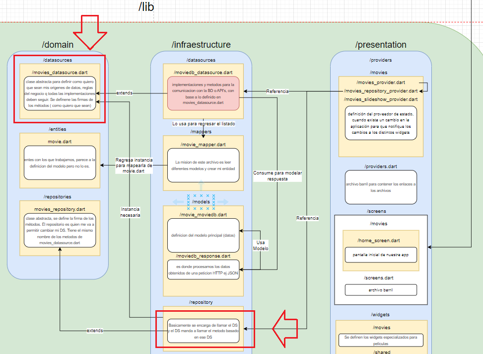
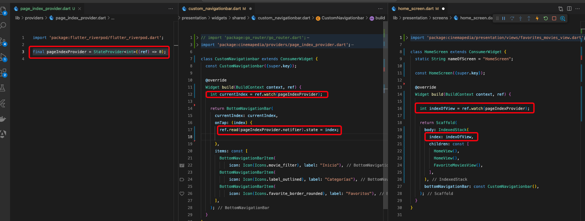

# cinemapedia

Esta sección dejará las bases de todo lo que empezaremos a construir aquí y en un par de secciones adicionales.

Lo más importante de esta sección es comprender los principios de arquitectura limpia que se siguen (todos menos casos de uso)

La idea es que desde el inicio comencemos a crear código reutilizable, estructurado y con la posibilidad de expandirlo desde el inicio, de esta manera será más simple poder añadir nuevas funcionalidades a futuro.

Puntualmente veremos:

- Datasources
  - Implementaciones
  - Abastracciones
- Repositorios
  - Implementaciones
  - Abstracciones
- Modelos
- Entidades
- Riverpod
  - Provider
  - StateNotifierProvider
  - Notifiers
- Mappers

Todo el objetivo de la sección es poder establecer los cimientos ordenados de nuestra arquitectura para reforzarlos y verlos en la práctica.

Esta segunda sección tiene por objetivo realizar 4 consultas a TheMovieDB para obtener:

- Películas populares
- Películas en cines
- Películas mejor calificadas
- Películas que próximamente estarán en cines

Para lograr esto seguiremos trabajando con los mismos principios y poco a poco iremos creando una aplicación robusta.

También aprenderemos un poco sobre:

- Custom AppBar
- Scroll horizontal infinito
- Slivers

Esta tercera sección está dedicada al diseño de la pantalla de película de forma individual. Aprenderemos:

- Paso de parámetros
- Loaders
- Deep Linking
- Caché Local
- Slivers

Esto significa que tenemos que volver a trabajar una nueva entidad, datasources, repositorios y demás para mantener separadas las responsabilidades.

Esta cuarta sección tiene por objetivo aprender a realizar búsquedas y trabajar con el SearchDelegate.

Puntualmente veremos:

- SearchDelegate
- Datasources
- Repositorios
- Búsquedas contra TheMovieDB
- Debouncer
- Streams
- Builders
- DRY
- Providers

En esta sección construiremos un motor de búsqueda completo y robusto para que nuestros usuarios puedan buscar sus películas ahí y preservar búsquedas anteriores para mejorar el rendimiento del mismo.

Esta quinta sección tiene por objetivos puntuales:

- Navegación entre tabs
- Preservar estado
- Go_Router
  - Redirect
  - ShellRoute
  - SubShellRoutes

Es una sección que tiene dos códigos fuente, el primero cuenta con la implementación recomendada de GoRouter y la segunda es la solución que hice para mantener el estado, que a muchas personas les parece más fácil que la misma solución oficial.

## Diagrama

## TMDB

https://www.themoviedb.org/

https://developer.themoviedb.org/docs/getting-started

https://developer.themoviedb.org/docs/authentication-application

https://developer.themoviedb.org/reference/movie-details

## Reforzamiento de conceptos de arquitectura

A continuación vamos a ver:

- Entidades
- Datasources
  - Abstractos
  - Implementaciones
- Repositories
  - Abstractos
  - Implementaciones
- Gestor de Estado e interacciones con él

### Entidades

Podemos pensar en las entidades como objetos que son y serán idénticos entre diferentes aplicaciones de nuestra empresa.

Por ejemplo, Tesorerías será el mismo objeto en distintas aplicaciones y se puede reutilizar.

No estamos hablando de Bases de Datos.

### Datasources

Son las fuentes de datos.

No debería importar de donde venga la data.

Si de TheMovieDB, IMDB, Netflix API, etc.

### Repositories

Son quienes llamas a nuestro datasources.

Deben de ser flexibles para poder cambiar los datasources en cualquier momento sin afectar nuestra aplicación.

### Gestor de estado

Sirve de puente entre nuestros casos de uso (en este caso el repositorio) y realizan los cambios visuales en los Widgets.

En caso de una implementación completa de arquitectura limpia, el gestor de estado llama casos de uso, y estos al repositorio.

### Abstractos vs Implementaciones

Hablamos de clases abstractas cuando creamos clases que establecen las reglas de negocio.

Hablamos de implementaciones cuando creamos clases que implementan las reglas de negocio indicadas por las clases abstractas.

### Resumen

- Las Entidades son atómicas (las unidades más pequeñas)
- Los Repositorios (sus implementaciones) llaman a los Datasources (a una abstracción del Datasource)
- Las implementaciones de los Datasources son quienes hacen el trabajo
- El Gestor de estado es el puente que ayuda a realizar los cambios en el UI

## Estructura de carpetas del proyecto

- `config`
  - `constants` con la variables de entorno
  - `router` con el sistema de configuración de rutas
  - `theme` con nuestro tema, que no va a ser tan dinámico, pero queda organizado
- `domain` tenemos nuestras reglas de negocio
  - `datasources` con los origenes de datos. Definimos las reglas que una fuente de información debe de tener para que yo puede traer esa data y usarla en mi app. Aquí solo tenemos la parte abstracta
  - `entities` con la data más apegada a las reglas de negocio. No depende de la BD
  - `repositories` es similar a los datasources, con la diferencia de que nosotros llamamos al repositorio para acceder al datasource. Un repositorio envuelve al datasource, de forma que podemos cambiar el datasource, pero el repositorio debería ser el mismo. Aquí solo tenemos la parte abstracta
- `infrastructure` también llamada data
  - `datasources` es donde están las implementaciones de nuestros datasources. Cada archivo aquí situado debería hacer solo una tarea
  - `mappers` donde, dada la data recibida de una manera, digamos a través de una API, se transforma a la información como la vamos a necesitar en otras entidades. Si cambia la API, solo tendré que cambiar el mapper. Usualmente el nombre de los archivos que se crean aquí son iguales a los nombres de las entidades que usamos en la aplicación.
  - `models` nos sirve para tipar una respuesta HTTP, evitando tener que usar la notación objeto["campo"], sino objeto.campo, facilitando el trabajo con el mapper
  - `repositories` es donde tenemos la implementación del repositorio
- `presentation`
  - `providers` donde vamos a usar Riverpod y sirven de puente de conexión entre las capas anteriores y la capa de presentación. Todos nuestros Widgets deberían de interactuar de alguna manera con nuestros providers para que sean ellos quienes interactuen allá fuera. Si el día de mañana cambia nuestro gestor de estado (pasar a Bloc por ejemplo) si que va a necesitar trabajo, pero todo lo demás queda igual
  - `screens` donde indicamos nuestras pantallas UI

## Creación de proyecto desde VSCode

- Pulsar Cmd+Shift+P
- Escribir y seleccionar Flutter: New Project
- Seleccionar Application
- Seleccionar el directorio donde guardaremos el proyecto
- Indicar el nombre del proyecto, que deberá ser todo en minúsculas, y, si se separa por palabras, usar el guión bajo.
  - Nuestro proyecto se llama: `yes_no_app`

## Lanzar emulador

- Pulsar Cmd+Shift+P
- Escribir y seleccionar Flutter: Launch Emulator
  - Yo voy a hacer las pruebas con el simulador de iOS
- Estando en el archivo main.dart, volver a pulsar Cmd+Shift+P
- Escribir y seleccionar Flutter: Select Device
- Seleccionar el dispositivo iOS
- Pulsar F5

## Inicio de aplicación - Estilo y Router

Empezamos creando, dentro de la carpeta `lib` la carpeta `config` y dentro las carpetas `theme` y `router`.

En `theme` creamos el archivo `app_theme.dart`.

En `router` creamos el archivo `app_router.dart`. Tenemos que instalar `go_router`.

De nuevo, dentro de la carpeta `lib` creamos la carpeta `presentation`, dentro la carpeta `screens` y dentro la carpeta `movies` donde situaremos todas las pantallas relacionadas con movies.

En `movies` creamos el archivo `home_screen.dart`.

Y como sabemos que vamos a tener más screens, en la carpeta `screens` creamos el archivo de barril `screens.dart`.

## Entidad - Repositorios y Datasources

Empezamos creando, dentro de la carpeta `lib` la carpeta `domain`.

Dentro de `domain` vamos a crear las carpetas `entities`, `datasources` y `repositories`.

En la carpeta `entities` creamos la entidad `movie.dart`.

En la carpeta `datasources` creamos el datasource `movies_datasource.dart` donde NO va la implementación, sino el contrato que deben cumplir los fuentes que lo implementen.

En la carpeta `repositories` creamos el repositorio `movies_repository.dart` donde NO va la implementación, sino el contrato que deben cumplir los fuentes que lo implementen.

Los repositorios van a llamar al datasource, porque el repositorio me va a permitir que se pueda cambiar el datasource sin que afecte al resto de la aplicación.

## Variables de entorno

Creamos en la raiz del proyecto el archivo `.env` y ahí indicamos nuestra clave de TMDB.

Flutter no sabe de la existencia del archivo `.env` y no los maneja por defecto. Tenemos que configurarlo.

Hay muchos paquetes que sirven para manejar los archivos de variables de entorno.

Vamos a usar: https://pub.dev/packages/flutter_dotenv

En esa URL puede verse la documentación para configurarlo en nuestra app de Flutter.

Para no tener que estar acordándonos de los nombres de nuestras variables de entorno, en la carpeta `config` creamos una carpeta `constants` y dentro un archivo llamado `environment.dart`.

El objetivo de esta clase `Environment` es alojar las variables de entorno, definidas estáticamente, para que sean fáciles de utilizar.

## Datasource - Obtener películas en cines

Vamos a implementar el método `getNowPlaying()` de la clase abstracta `MoviesDatasource`.

Para ello, en la carpeta `lib` creamos la carpeta `infrastructure`, que contendrá las implementaciones de los métodos que están en nuestra carpeta `domain`. Dentro creamos la carpeta `datasources` y dentro creamos el fuente `moviedb_datasource.dart`.

## TheMovieDB - Modelos

En la carpeta `infrastructure` creamos la carpeta `models`, dentro creamos la carpeta `moviedb` y dentro creamos dos archivos: `moviedb_response.dart` y `movie_moviedb.dart`.

## MovieMappers - MovieDB hacia MovieEntity

Como el modelo de datos de MovieDB (`infrastructure/models/moviedb/movie_moviedb.dart`) puede cambiar, lo que hacemos es mapear ese modelo al nuestro (`domain/entities/movie.dart`), que será fijo y no cambia. Con nuestra entidad, seguiremos trabajando en nuestra app.

En la carpeta `infrastructure` creamos la carpeta `mappers` y dentro el archivo `movie_mapper.dart`, cuya única misión es leer los diferentes modelos que pueda haber y crear mi entidad.

## MovieRepository - Implementación

En la carpeta `infrastructure` creamos la carpeta `repository` y dentro el archivo `movie_repository_impl.dart`.

## Crear la instancia del repositorio - Riverpod

En la carpeta `presentation` creamos la carpeta `providers`, dentro la carpeta `movies` y dentro creamos el archivo `movies_repository_provider.dart`, que es quien crea la instancia de `movie_repository_impl.dart`.

## NowPlaying Provider y Notifier

En la carpeta `presentation/providers` creamos el archivo `movies_providers.dart` que nos va a servir para definir todos los otros providers.

## Archivo de barril

En la carpeta `presentation/providers` nos creamos el archivo de barril `providers.dart`.

## Custom AppBar

Para crear nuestro AppBar personalizado, creamos en la carpeta `presentation` la carpeta `widgets`, dentro la carpeta `shared` y dentro el archivo `custom_appbar.dart`.

Se hace con esta estructura de carpetas porque la parte del appbar no tiene relación con las movies, es más general.

Como sabemos que van a haber más widgets creamos en la carpeta `widgets` el archivo de barril `widgets.dart`.

## Carrusel de películas

Para hacer este Widget Carrusel vamos a usar un Widget de terceros (https://pub.dev/packages/card_swiper) para hacerlo rápidamente.

En la carpeta `presentation/widgets` creamos la carpeta `movies` y dentro el archivo `movies_slideshow.dart`, porque quiero que me sirva para mostrar películas y veo que está muy amarrado a mostrar películas.

## Movies Slideshow Provider

En la carpeta `presentation/providers/movies` creamos el archivo `movies_slideshow_provider.dart`.

## CustomBottomNavigationBar

https://www.youtube.com/watch?v=HB5WMcxAmQQ

En la carpeta `presentation/widgets/shared` creamos el archivo `custom_bottom_navigation.dart`.

## Movie Horizontal ListView

En la carpeta `presentation/widgets/movies` creamos el archivo `movie_horizontal_listview.dart`.

## HumanFormats - Números cortos

https://pub.dev/packages/intl

Para evitar que, si un día cambia la forma de usarse este paquete afecte a nuestro código, creamos un archivo aparte.

En la carpeta `config` creamos la carpeta `helpers` y dentro el archivo `human_formats.dart`.

## FullScreen Loader

En la carpeta `presentation/widgets/shared` creamos el archivo `full_screen_loader.dart` que es un Widget de carga a pantalla completa.

## Escuchar múltiples providers simultáneamente

Vamos a crear un provider que devuelva un booleano que me diga cuando tienen los 4 providers la data de las películas.

En la carpeta `presentation/providers/movies` creamos el archivo `initial_loading_provider.dart`.

## Screen para una película

En la carpeta `presentation/screens/movies` creamos el screen `movie_screen.dart`.

## MaterialScrollBehavior para hacer scroll horizontal en Web

En la carpeta `config` he creado la carpeta `scroll` y dentro he creado el archivo `custom_scroll_behavior.dart`.

## Obtener película por ID - Datasource

https://api.themoviedb.org/3/movie/505642?api_key=myapi&language=es-ES

Arriba vemos la petición que se puede hacer en Postman para obtener los datos de esa película.

Los datos obtenidos no se parecen a lo que tenemos hasta ahora. Tenemos, por tanto, que crear un nuevo método en el datasource, un nuevo método en nuestro repository y un nuevo modelo específico de moviedb (porque es la respuesta que viene de TheMovieDB) para mapear los datos y que me servirá para implementar el mapper de esa respuesta a mi objeto personalizado (entity) `movie.dart`.

En la carpeta `infrastructure/models/moviedb` creamos el modelo `movie_details.dart`.

## MovieDB to Entity

Como se ha dicho, una vez tenemos nuestro modelo, ahora creamos un mapper para mapearlo a nuestra entity Movie `movie.dart`.

Usamos el mismo fuente de mappers, es decir, `infrastructure/mappers/movie_mapper.dart` y creamos un nuevo método estático.

## Movie Details - Caché Local

Para manejar la información de MovieDetails desde la data a la UI creamos un nuevo provider.

En la carpeta `presentation/providers/movies` creamos el provider `movie_info_provider.dart`.

## Actores de la película

Teniendo en cuenta el concepto de responsabilidad única, vamos a crear un provider idéntico a `movie_info_provider.dart` que solo se encargue de manejar los actores. Buscamos providers pequeños fáciles de mantener.

Igual para entity, datasource y repository. Empezamos:

En la carpeta `domain/entities` creamos la entity `actor.dart`.

En la carpeta `domain/datasources` creamos la fuente de datos `actors_datasource.dart`.

En la carpeta `domain/repositories` creamos la fuente de datos `actors_repository.dart`.

Empezando con las implementaciones, creamos:

En la carpeta `infrastructure/models/moviedb` creamos el modelo `credits_response.dart` usando Postman para obtener la data y quicktype.io para obtener el modelo.

En la carpeta `infrastructure/mappers` creamos el mapper `actor_mapper.dart`.

En la carpeta `infrastructure/datasource` creamos la fuente de datos `actor_moviedb_datasource.dart`.

En la carpeta `infrastructure/repositories` creamos el repositorio `actor_repository_impl.dart`.

En la capa de presentation creamos:

En la carpeta `presentation/providers` creamos la carpeta `actors` y dentro los providers `actors_repository_provider.dart` y `actors_by_movie_provider.dart`.

## Probar obtención de actores

Esta prueba la hacemos en `presentation/screens/movies/movie_screen.dart` donde hacemos la petición a movieInfoProvider.notifier y hemos duplicado esa sentencia. Luego ponemos un breakpoint en algún punto que nos interese, en este caso la función del provider `loadActors()` y vemos los valores que carga.

## Mostrar los actores de la película

Lo hacemos en `presentation/screens/movies/movie_screen.dart` donde creamos un nuevo ConsumerWidget `_ActorsByMovie` para ello.

## SearchMovies - Datasource y Repository

Podemos empezar a trabajar por la interfaz de usuario o por la parte de la data, pero al final la idea es tenerlo todo bien estructurado.

Nosotros vamos a empezar por las reglas de negocio.

Vamos a crear nuestro datasource y nuestro repository.

En la carpeta `domain/datasources` vamos a usar nuestro datasource ya existente `movies_datasource.dart` y añadimos una nueva función de búsqueda.

En la carpeta `domain/repositories` vamos a usar nuestro repository ya existente `movies_repository.dart` y añadimos una nueva función de búsqueda.

Vamos ahora a nuestra infraestructura.

En la carpeta `infrastructure/datasources` vamos a usar nuestra implementación del datasource ya existente `moviedb_datasource.dart` y añadimos la implementación de nuestra nueva función de búsqueda.

En la carpeta `infrastructure/repositories` vamos a usar nuestra implementación del repository ya existente `movie_repository_impl.dart` y añadimos la implementación de nuestra nueva función de búsqueda.

## SearchDelegate

Vamos a mostrar una búsqueda.

Toda la funcionalidad de búsqueda ya la tiene Flutter por defecto.

En la carpeta `presentation/widgets/shared` vamos a usar nuestro fichero ya existente `custom_appbar.dart` que es donde tenemos el icono de búsqueda, y vamos a llamar a una función que ya viene en Flutter llamada `showSearch()`.

Dicha función necesita, además del context, un delegate.

En la carpeta `presentation` creamos la carpeta `delegates` y dentro el archivo `search_movie_delegate.dart`, cuya clase va a extender de `SearchDelegate`.

## Debounce Manual

En la búsqueda, no es conveniente que cada vez que se pulsa una tecla, haga la petición de búsqueda.

Lo normal es esperar a que el usuario deje de escribir durante un periodo de tiempo para realizar la petición.

Esto es porque su conexión a Internet puede ser limitada, o su plan de datos no ser ilimitado, y además va a mejorar su experiencia.

## Search Movies Providers

Hacemos este provider para poder mantener el texto de la película que se buscó aun cuando salimos a la pantalla principal, es decir, si introducimos el texto de una película y salimos a la pantalla principal, si luego pulsamos de nuevo en buscar una película, mantiene el texto de la película anterior.

En la carpeta `presentation/providers` creamos la carpeta `search` y dentro el provider `search_movies_provider.dart`.

También vamos a tener un estado para mantener las películas que ya se buscaron en memoria y, al volver a la búsqueda, no tener que volver a realizar la petición http.

## Preparación de vistas

Si pulsamos en el botón Favoritos debería de mostrarse una nueva página parcial (que está dentro de otro Widget padre y tiene su Scaffold) y que es conocida como un `View`. Es parecida a un screen solo que es parcial. Hay otros desarrolladores que no implementan las vistas y las dejan como screens porque técnicamente una vista es un screen, incluso pueden tener un Scaffold. Es más un concepto, una terminología lo que separa a las vistas de los screens.

Al final, lo que queremos es tener tres vistas, `HomeView` (nuestro inicio y que ya estaba listo y que cogemos de `home_screen.dart`), `CategoriesView` y `FavoritesView` para cambiar entre diferentes pantallas.

En la carpeta `presentation` creamos otra carpeta `views` y dentro otra carpeta `movies` donde creamos las views `favorites_view.dart,` `home_views.dart` que contiene el código que estaba en `home_screen.dart`.

También nos creamos en `views` un archivo de barril `views.dart`.

En la rama `go-router-oficial` puede verse la implementación de las vistas usando GoRouter, con keep alive (StatefulShellRoute), es decir, preservando el estado cuando voy a favoritos y luego regreso al inicio. Además, cuando voy a una película, no se muestra el CustomBottomNavigation.

En la rama main hacemos las vistas de otra forma, también preservando el estado y sin mostrar el CustomBottomNavigation en el detalle de la película. Lo mejor es seguir el estandar de GoRouter, pero en el momento del curso, esto no se podía hacer.

Lo que hacemos es que no recibimos en nuestra página principal el Widget que hay que mostrar, porque queremos preservar el estado. Y como hacemos para preservar el estado es el objetivo de esta parte que viene.

## Configuración del router

Cambiamos `app_router.dart`, su initialLocaltion y su path para que nos venga la view o screen que queremos mostrar. Para ello también modificamos `home_screen.dart`.

Para hacer el cambio del listado de Widgets usamos un Widget que sirve para preservar el estado, llamado `IndexedStack`.

NOTA: Hay incluso otra forma de hacer todo esto, usando Provider

## Testing

En Postman ejecutar un `GET` con la siguiente ruta: `https://api.themoviedb.org/3/movie/550?api_key=my_key&language=es-ES&page=4` donde `my_key` es la clave de la cuenta de TMDB para confirmar que nuestra key funciona correctamente.

Para obtener los actores, se puede ejecutar en Postman este `GET` con la siguiente ruta: `https://api.themoviedb.org/3/movie/934632/credits?api_key=my_key&language=es-ES`

Para realizar búsquedas de películas, se puede ejecutar en Postman este `GET` con la siguiente ruta: `https://api.themoviedb.org/3/search/movie?query=batman&api_key=my_key&language=es-ES`
