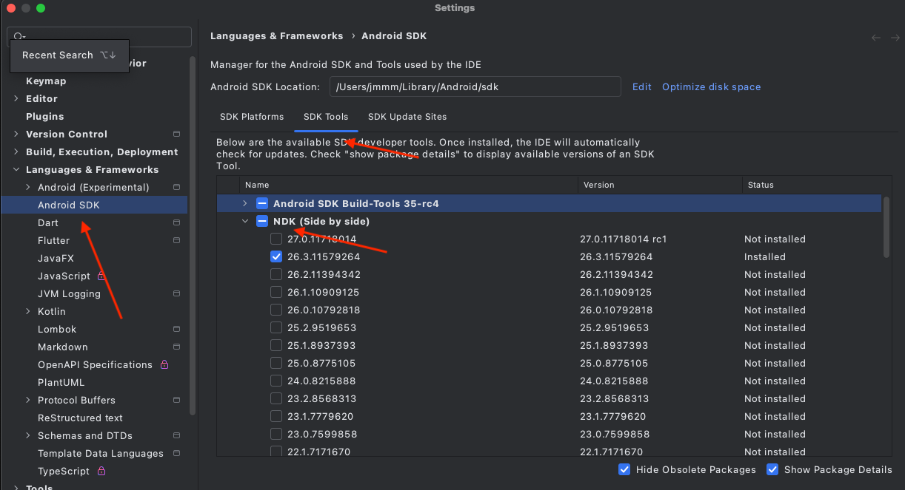
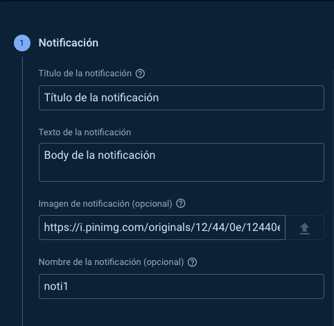
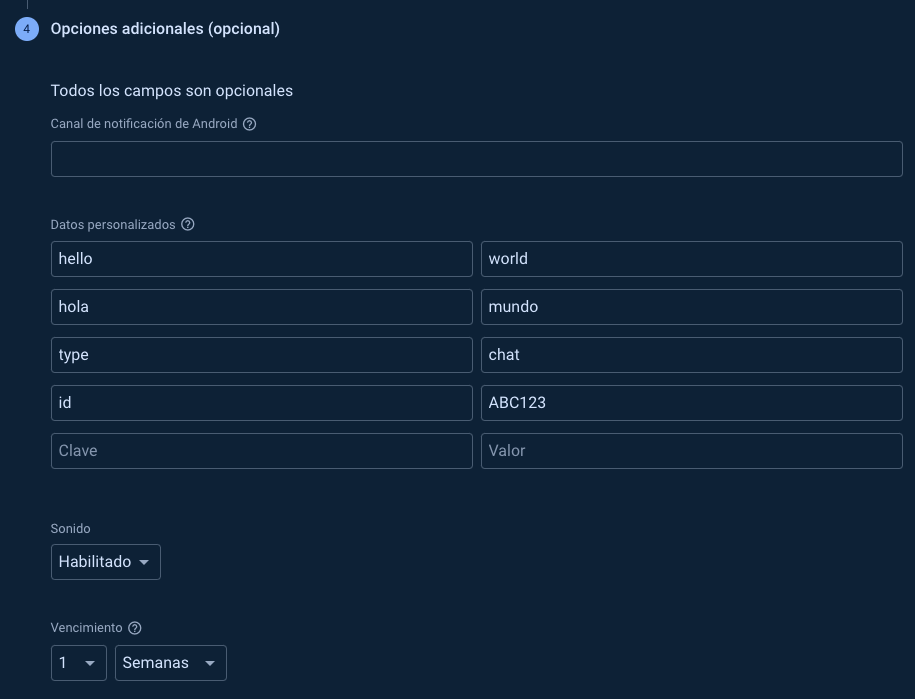
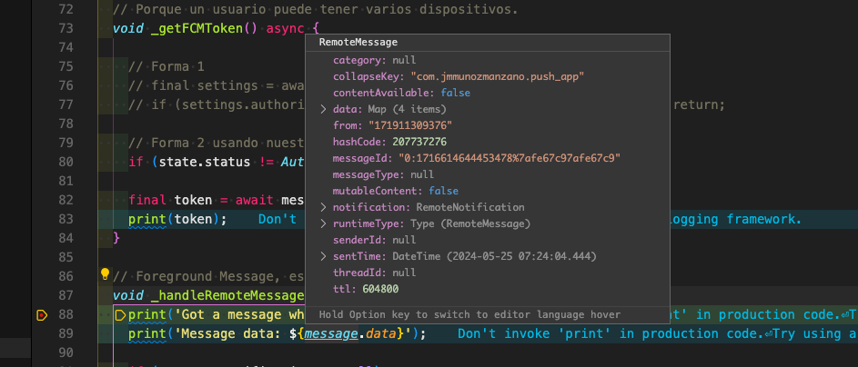
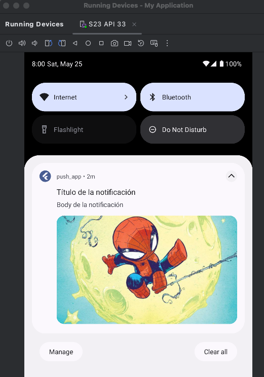
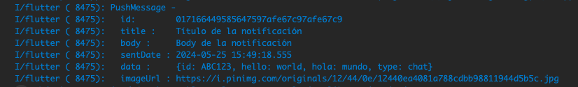
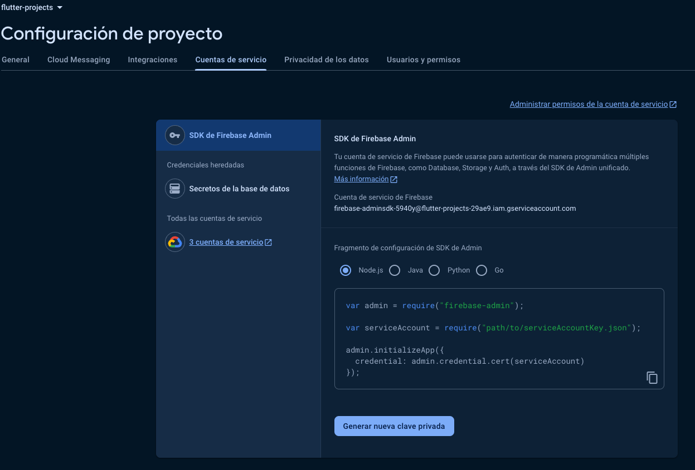

# Push Notifications + Local Notifications

Esta sección está dedicada enteramente al manejo de Push en Android, inclusive si lo que quieren es únicamente IOS, es recomendado y necesario que lo sigamos, ya que el manejo después será el mismo (con otras configuraciones)

Puntualmente veremos:

- Tipos de estado de notificaciones
- Métodos para su manejo
- Entidades
- BLoC
- Leer las notificaciones push
- Interacciones
- Navegación a diferentes rutas basados en la PUSH
- Firebase
- Configuraciones de FCM
- Configuración de proyecto de Firebase
- Tareas y más

Es una sección muy completa sobre el manejo de las notificaciones push.

En la nueva sección, vamos a enviar notificaciones desde una Rest API.

El objetivo de esta sección es simple:

Crear un backend rápido para obtener el Bearer token de Firebase, y con eso, poder probar el Restful API de la forma recomendada de Firebase.

También les explicaré una forma simple, pero ya no es la recomendada.

## Inicio de aplicación

- Pulsamos `Cmd+Shift+P` y seleccionamos `Flutter: New Project`
- Seleccionamos `Empty Application`
- Tras indicar donde queremos alojar el proyecto, le damos el nombre `push_app`
- Pulsamos `Cmd+Shift+P` y seleccionamos `Flutter: Launch Emulator`, seleccionando un emulador de Android
- Pulsamos `Cmd+Shift+P` y seleccionamos `Flutter: Select Device`, seleccionando el emulador de Android
- He cambiado en el fichero `android/gradle/wrapper/gradle-wrapper.properties` la property `distributionUrl` para que tenga la versión de Gradle que yo tengo en mi Mac

Creamos en `lib` el directorio `config` y dentro de este los directorios `router` y `theme`.

Creamos en `lib` el directorio `presentation` y dentro la carpeta `screens`.

Dentro de la carpeta `theme` creo el archivo `app_theme.dart`.

Dentro de la carpeta `screen` creo el archivo `home_screen.dart`.

Dentro de la carpeta `router` definimos nuestras rutas `app_router.dart`.

Vamos a instalar un par de paquetes usando `Pubspec Assist`, separando con comas: equatable, flutter_bloc, go_router

IMPORTANTE: Para la parte de Firebase es necesario tener la versión de Java 17.

## Bloc y FlutterFire

Vamos a hacer la configuración de nuestro Bloc para saber como va a fluir nuestra información.

Vamos a usar FlutterFire, que es una implementación oficial de Firebase para Flutter.

Documentación: https://firebase.flutter.dev/docs/messaging/notifications/

Tal y como se indica aquí `https://firebase.flutter.dev/docs/messaging/overview`, empezamos las instalaciones.

Por ahora solo vamos a instalar, por ahora, y usando `Pubspec Assist` el paquete `firebase_messaging`. Lo instalamos, sin hacer todavía ninguna configuración, porque en nuestro Bloc vamos a manejar una propiedad igual a un estado que me va a dar ese paquete, y así no hay que crear una enumeración personalizada.

Dentro de la carpeta `presentation` creamos la carpeta `blocs`. En esa carpeta pulsamos click derecho y seleccionamos `Bloc: New Bloc` y le ponemos el nombre `notifications`. Renombramos la carpeta bloc nueva que aparece a notifications.

## Solicitar permisos

Vamos a solicitar los permisos de las notificaciones push. Si el usuario no acepta, no vamos a poder mandarle notificaciones push.

IMPORTANTE: Existe un paquete llamado `permission_handler` que nos permite configurar cualquier permiso que necesite nuestra app, `https://pub.dev/packages/permission_handler`. No lo vamos a usar, pero conviene saberlo.

Si arrancamos el proyecto nos da un error indicando que, para usar las notificaciones push, necesitamos configurar lo siguiente en la ruta `/android/app/build.gradle` del proyecto:

```
  android {
    defaultConfig {
      minSdkVersion 19
    }
  }
```

Pero igualmente nos falla el proyecto y no arranca. Esto es porque tenemos que configurar una instancia de Firebase.

## Configurar proyecto de Firebase

Para poder comenzar la configuración, lo primero es tener un proyecto en Firebase: `https://firebase.google.com/?hl=es-419`

Nos interesa de Firebase sobre todo la parte de `Cloud Messaging (FCM)` que no tiene ningún coste.

He creado el proyecto `flutter-projects`: `https://console.firebase.google.com/project/flutter-projects-29ae9/overview?hl=es-419`

Si volvemos a `https://firebase.flutter.dev/docs/overview` veremos que nos pide instalar `firebase_core`. Nosotros lo vamos a configurar mediante el CLI, con el comando `flutterfile configure` que también aparece en esta documentación. Por tanto, lo primero es instalar el CLI. La forma más fácil de hacerlo es ir a `https://firebase.google.com/docs/cli?hl=es` y seguir los pasos, que básicamente consiste en ejecutar, uno después de otro, los siguiente comandos:

- Abrir terminal
- curl -sL https://firebase.tools | bash
- Cerrar la terminal
- Abrir otra terminal
- firebase login

Si necesitamos, podemos hacer `firebase logout` también.

Cuando configuremos Firebase, aunque otras personas accedan a nuestra configuración, no van a poder mandar notificaciones push porque va a estar amarrado a un id de la aplicación.

## Cambiar id de la aplicación

El identifier de la aplicación es lo que hace que dos aplicaciones con el mismo nombre sean distintas. Tenemos que cambiar ese id tanto en la carpeta de ios como en la de android, ya que, si ejecutamos el comando `dart pub global activate flutterfire_cli` que aparece en `https://firebase.flutter.dev/docs/overview/`, va a crear la configuración basada en el identificador que tiene nuestra aplicación, que, dada la forma en la que hemos creado el proyecto, es bastante genérico.

Para Android, será `com.example.push_app`, es decir `com.example.` concatenado con el nombre que le hayamos dado al proyecto.

Para IOs, será `com.example.pushApp`, es decir, `com.example` concatenado con el camel case del nombre del proyecto, sin guiones de ningún tipo.

Si queremos publicar esto en la Apple Store o la Google Play Store, vamos a tener problemas, porque seguro que ese nombre ya existe.

Busco, usando VSCode, todos los sitios donde aparezca ese nombre y lo cambio, para Android, por el nombre `com.jmmunozmanzano.push_app`. Además, ir a la ruta `android/app/src/main/kotlin/com` y sustituir el directorio `example` por `jmmunozmanzano`.

Para IOS, se puede cambiar ejecutando el archivo `Runner.xcworkspace`. Se abrirá el programa `Xcode`, ir a TARGETS Runner, tab Signing & Capabilities, y cambiar, en Signing, el Bundle Identifier a `com.jmmunozmanzano.pushApp`. Si no está asignado, también indicamos el Team. Pero también se puede cambiar al igual que se ha hecho en Android, es decir, buscando en VSCode y cambiando a mano. Es posible que de esta última forma se evite algún problema al configurar Flutter con Firebase.

Ahora ya si podemos hacer la configuración de Firebase. Tener en cuenta que Firebase va a amarrar nuestro bundle id o package identifier para configurarlo y permitir la comunicación de solo ese id con Firebase. Si se hiciera después, tendríamos que volver a configurar Firebase de nuevo.

NOTAS:

- Una mejor forma para crear el proyecto Flutter y así evitar todas las modificaciones de esta clase, es realizarlo con el CLI, en mi opinión es más sencillo. Aquí dejo un ejemplo:

`flutter create --org com.jmmunoz push_app`

Con ese comando, Flutter, al crear el proyecto, ya nos genera el ID correcto en cada uno de los archivos, por lo que no tendríamos que cambiarlo luego manualmente uno por uno.

- Otra opción muy sencilla para evitar tener que renombrar el nombre del dominio es editar el archivo settings.json de la configuración de vscode y añadir la linea:

`"dart.flutterCreateOrganization": "es.nombredeorganizacion",`

Tal y como viene en la documentación de Flutter (https://dartcode.org/docs/settings/#dartfluttercreateorganization).

¿Qué pasa con los que usamos un dispositivo físico?

Si estás usando un dispositivo físico para probar tu aplicación, no hay ninguna interacción directa con el archivo AndroidManifest.xml. El archivo de manifiesto se utiliza principalmente para configurar aspectos como los permisos de la aplicación, las actividades principales, los servicios, etc. Por lo tanto, los cambios en este archivo no afectarán directamente la funcionalidad en un dispositivo físico.

¿También tenemos que hacer el renombre?

Por lo que sí, es necesario realizar los cambios que se indican para poder continuar.

¿Afecta de alguna manera al dispositivo físico como que no lo encuentra?

Realizar cambios en el archivo AndroidManifest.xml no debería afectar la capacidad de tu aplicación para ejecutarse en un dispositivo físico, a menos que realices cambios que impidan que la aplicación se ejecute correctamente debido a configuraciones incorrectas en el manifiesto. Por lo tanto, es importante revisar cuidadosamente los cambios que realices en el archivo de manifiesto para asegurarte de que no haya errores que puedan afectar el funcionamiento de la aplicación en un dispositivo físico.

## Configurar Flutter con proyecto de Firebase

Ahora ya si que podemos hacer la configuración de Firebase con nuestra aplicación de Flutter `https://firebase.flutter.dev/docs/overview/`.

- En VSCode, usando Pubspec Assist, indicamos: `firebase_core`
- Ejecutamos en el terminal, en la carpeta del proyecto: `dart pub global activate flutterfire_cli`

  - Haced caso de este Warning, si sale:
  - ```
      Warning: Pub installs executables into $HOME/.pub-cache/bin, which is not on your path.
      You can fix that by adding this to your shell's config file (.zshrc, .bashrc, .bash_profile, etc.):

      export PATH="$PATH":"$HOME/.pub-cache/bin"
    ```

- Ejecutamos en el terminal, en la carpeta del proyecto: `flutterfire configure`
  - Seleccionamos el proyecto que creamos antes en Firebase, en mi caso, el id del proyecto es `flutter-projects-29ae9`
  - Seleccionamos las configuraciones que vamos a querer para este proyecto, en mi caso solo android e ios (se desmarcan los checks pulsando la barra espaciadora)

Cuando terminemos, veremos que en la carpeta `lib` se ha creado un fuente `firebase_options.dart`. Este archivo se puede usar para hacer cualquier otra configuración, por si queremos más tarde usar storage, mensajería... Este mismo archivo se puede usar.

## Inicializar la aplicación de Firebase en Flutter

Antes de intentar levantar el proyecto, todavía nos hace falta realizar un par de pasos.

Seguimos con los pasos de la web: `https://firebase.flutter.dev/docs/overview/`, aunque lo vamos a hacer un poco distinto para centralizarlo en nuestro Bloc.

`WidgetsFlutterBinding.ensureInitialized();` Esta línea nos la llevamos a `main.dart`.

```
 await Firebase.initializeApp(
    options: DefaultFirebaseOptions.currentPlatform,
  );
```

Y esta parte la centralizamos en nuestro Bloc, en la carpeta `presentation/blocs`, archivo `notifications_bloc.dart`.

Ya podemos levantar la aplicación.

NOTA: Me ha dado un error ` Could not resolve all files for configuration ':app:debugRuntimeClasspath'.` que he solventado de la siguiente forma:
En el archivo `android/app/build.gradle` he modificado la version Java de la 1.8 a la 17:

```
    compileOptions {
        sourceCompatibility JavaVersion.VERSION_17
        targetCompatibility JavaVersion.VERSION_17
    }

    kotlinOptions {
        jvmTarget = '17'
    }
```

He puesto mi versión de Java a la 17: `jenv global temurin64-17.0.10` y he tenido que reiniciar mi máquina para que lo coja bien.

Pero además he borrado el sdk y lo he vuelto a bajar de nuevo. También he bajado una versión NDK en IntelliJ Idea.



Una vez me ejecuta la aplicación, pulso el engranaje y cuando me pregunta por el permiso pulso `Allow`.

## Actualizar el estado acorde a los permisos

El status que aparece en `notifications_bloc.dart`, en el método `requestPermission()`, cuando indico `settings.authorizationStatus` lo quiero almacenar en mi estado.

Ya tenemos un espacio listo para eso, que está en `notifications_state.dart`, variable `status` que es el mismo status de Firebase que quiero manejar, aunque también podríamos crear un estado propio basado en una enumeración personalizada, y en ese caso haría falta un mapper...

Recordar que, como estamos en Bloc, para cambiar ese estado necesitamos disparar un evento. Para ello:

- Creamos una nueva clase evento `NotificationStatusChanged` en `notifications_event.dart`
- Creamos un listener para manejarlo (un handler) en `notifications_bloc.dart`. Es un método que llamo `_notificationStatusChanged()`
- Disparamos el evento cuando estoy solicitando esos permisos. Los permisos los estoy solicitando desde el mismo bloc `notifications_bloc.dart` en el método `requestPermission()`
- Recordar que, al cambiar el bloc, hay que hacer un full restart de la app para que se cojan los cambios
- Ahora, al pulsar el engranaje, veremos que el mensaje cambia a `AuthorizationStatus.authorized`

El inconveniente es que, cada vez que recargo la app, no es capaz de determinar el estado authorized actual. Esto lo configuramos en el siguiente punto.

## Token del dispositivo y determinar permiso actual

Para determinar el permiso actual cada vez que arranque la app, nos creamos un método en `notifications_bloc.dart` llamado `_initialStatusCheck()`. Ahí obtenemos el estado del permiso.

Si lo autorizamos, queremos obtener el token que va a tener esta instalación de la app. Con ese token podemos mandar notificaciones a ese cliente en particular. Lo obtenemos en el método `_getFCMToken()`.

NOTAS:

Podemos mandar una campaña a todos los usuarios sin el token, ¿cómo se puede hacer algo así?

Para conseguir esta funcionalidad, podemos hacer uso de los topics.

Estos básicamente son canales/salas a los que podemos suscribirnos a través de Flutter (mediante código, al igual que obtenemos el token) y luego enviar notificaciones a todos los dispositivos que se encuentren suscritos a ese topic, sin hacer uso de tokens.

Puedes ver más de los topics: https://firebase.google.com/docs/cloud-messaging/android/topic-messaging?hl=es-419.

Una vez conocemos qué son, podemos usar estos para conseguir la funcionalidad que deseas.

Sería tan sencillo como en nuestra app de Flutter suscribirnos por defecto a un topic en todos los dispositivos (con el nombre "all" por ejemplo).

Así luego, ya sea desde una petición REST, o desde tu backend con el admin SDK de firebase, solo tendrías que indicar el topic all y ya enviarías la notificación a todos.

Para esto puedes revisar: https://stackoverflow.com/q/38237559.

## Escuchar mensajes push

Ver documentación: https://firebase.flutter.dev/docs/messaging/usage#foreground-messages

Para empezar, vamos a configurar nuestra app para escuchar mensajes cuando la app esté abierta (foreground messages).

En `notifications_bloc.dart` creamos el método `_handleRemoteMessage()` que es un listener.

Este listener lo vamos a poner a escuchar en el método `_onForegroundMessage()`.

Un listener es un stream y solo hay que `inicializarlo una vez`. Lo inicializamos en el constructor.

Hacemos un full restart de la aplicación y ya estamos listos para probarlo.

## Recibir nuestra primera notificación Push

A lo largo de este curso vamos a enviar notificaciones Push desde:

- La aplicación de Firebase
- Consola
- Postman, que a través de un RESTFul Api endpoint mande la notificación al Front

Empezamos enviando notificaciones desde Firebase.

- Vamos a nuestro proyecto, a messaging: `https://console.firebase.google.com/project/flutter-projects-29ae9/messaging/onboarding?hl=es-419`
- Pulsamos en `Crear la primera campaña`
- Seleccionamos el que indica `Mensajes de Firebase Notifications` y pulsamos `Crear`
- Rellenamos el formulario que aparece y pulsamos Siguiente
  
- En Orientación seleccionamos solo la parte de android porque ios no está configurado. Pulsamos siguiente
- En Programación seleccionamos `Ahora` y pulsamos siguiente
- En Opciones Adicionales indicamos lo que queramos y pulsamos `Guardar como borrador`
  - Se suele usar mucho el indicar un `type` para indicar el tipo de notificación. Todo esto es opcional
    
- Una vez tenemos el borrador, la editamos y pulsamos en el botón `Enviar mensaje de prueba`
- Cuando nos diga que indiquemos el token de registro de FCM, en VSCode, vamos a la DEBUG CONSOLE y lo deberíamos de tener, ya que en la app hemos hecho un print de ella. Pulsamos el icono para incluirlo y pulsamos `Probar`
- En un debug que he puesto, esto es lo que aparece
  
- Dejo que termine la ejecución
- Ahora, en el Android Emulator, dejo en segundo plano la app
- Vuelvo a `Enviar mensaje de prueba`
- Me debe saltar la notificación en el emulador. En la parte de arriba a la izquierda veré una F (de Flutter) y pulso con el ratón y la despliego hacia abajo. Veré la anotación de esta forma:
  

El comportamiento por defecto de una notificación push es abrir la aplicación, pero también se puede hacer que la notificación reaccione (lo vamos a ver en el curso) y naveguemos a otra pantalla, la guardemos en el dispositivo físico...

Nos falta la configuración Messaging Background Handler y cuando la aplicación está terminada.

## Notificaciones cuando la app está terminada

Hay que añadir una configuración para poder recibir una notificación cuando la app está terminada.

Ver la documentación: https://firebase.flutter.dev/docs/messaging/usage/#background-messages

En la url se indica claramente:

There are a few things to keep in mind about your background message handler:

- It must not be an anonymous function.
- It must be a top-level function (e.g. not a class method which requires initialization).

Debido a que el handler corre de manera aislada por fuera del contexto de la aplicación, no es posible hacer actualizaciones del state ni del UI que impacten esa lógica.

Si se puede grabar en alguna BD local o ciertas operaciones con plugins. Tenemos máximo 30 sg para realizar este proceso, si no, el dispositivo automáticamente mata el proceso. Por tanto, el procesamiento de la notificación push tiene que ser super rápida.

Pegamos el código de la URL en `notifications_bloc.dart`, método `firebaseMessagingBackgroundHandler` pero, como hemos dicho, fuera de la clase, para tener todo centralizado.

## Entidad para el manejo de notificaciones

Vamos a trabajar en `notifications_state.dart`, con la variable que creamos `final List<dynamic> notifications;`

En vez de grabar todo el `RemoteMessage`, vamos a crear un adaptador para que las notificaciones, cuando las reciba, siempre sean manejadas de la misma manera, independientemente de que la notificación sea de Android o IOs.

En la carpeta `lib` creamos una carpeta `domain`, dentro otra carpeta `entities` y dentro un archivo `push_message.dart`.

Una vez creado, ya podemos cambiar el dynamic de la variable notifications por el nuevo tipo `PushMessage` creado.

Con esta entidad `PushMessage`, vamos a `notificacions_bloc.dart`, al método `_handleRemoteMessage` y vamos a mapear el message a nuestro PushMessage.

Tenemos que realizar, desde Firebase, otro `Enviar mensaje de prueba`, y, como hemos puesto un print(), el resultado de nuestro mapeo podemos verlo en VSCode, pestaña DEBUG CONSOLE.

Ejemplo:



## Actualizar el estado con la nueva Notificación

Tenemos que:

- Creamos una nueva clase evento `NotificationReceived` en `notifications_event.dart`
- Disparamos el evento `notifications_bloc.dart` en el método `_handleRemoteMessage()`
- Creamos un listener para manejar el estado (un handler) en `notifications_bloc.dart`. Es un método que llamo `_onPushMessageReceived()`
- Vigilamos el estado de las notificaciones para mostrarlas en `home_screen.dart`
- Recordar que, al cambiar el bloc, hay que hacer un full restart de la app para que se cojan los cambios

Para probar, tenemos que enviar, desde Firebase, otro `Enviar mensaje de prueba`, y deberá aparecer visualmente en nuestra app.

## Segunda pantalla - Información de la notificación

Vamos a hacer una segunda pantalla a la que navegaremos y donde mostraremos los datos de la notificación.

En la carpeta `presentation/screens` creamos una nueva screen `details_screen.dart`.

Como esperamos recibir un id pero luego trabajamos con un StatelessWidget privado que necesita todo el PushMessage, nos creamos en el bloc una función para que, dado un id, recuperar de la lista de notificaciones todo el PushMessage.

Lo hacemos en el bloc porque es algo que espero reutilizar en un futuro.

En `notifications_bloc.dart` creo el método `getMessageById()`.

## Navegar a la segunda pantalla

Vamos a navegar a esta segunda pantalla que acabamos de crear.

En nuestro router `config/router/app_router.dart` nos creamos una nueva ruta.

En nuestro screen `presentation/screens/home_screen.dart` añadimos la llamada a esta nueva ruta cuando alquien pulse en el elemento de la lista.

Para probar todo esto, en la web de Firebase, en nuestro proyecto, enviamos otro mensaje de prueba. Cuando lo recibamos en el móvil y se vea en la lista de elementos, pulsamos sobre él y se abrirá la segunda pantalla donde se mostrará su detalle.

## Manejar interacciones con las notificaciones

Queremos hacer la siguiente feature:

Estando la app en segundo plano, queremos mandar una notificación desde Firebase. Cuando nos llegue al móvil, pulsaremos el icono de entrada de notificación, se abrirá la app e irá automáticamente al detalle (la segunda pantalla)

Para hacer esto, primero tenemos que mirar la documentación de Firebase: https://firebase.flutter.dev/docs/messaging/notifications#handling-interaction

En `main.dart` creamos un nuevo StatefulWidget `HandleNotificationInteractions`.

Notar que en `notificacions_bloc.dart` hemos hecho público el método `handleRemoteMessage()` para poder añadir a nuestra lista de elementos la notificación.

## Enviar notificaciones desde una REST API

El objetivo de esta nueva sección es enviar notificaciones desde un RESTFul API endpoint.

Vamos a usar Postman.

Para realizar el procedimiento hay dos formas recomendadas:

- Hacerlo via Admin SDK, instalando Firebase en el servidor: https://firebase.flutter.dev/docs/messaging/notifications#via-admin-sdks
- Si no queremos instalar Firebase en el servidor, y solo queremos hacer un llamado de un RESTFul API tradicional, podemos hacerlo de esta forma: https://firebase.flutter.dev/docs/messaging/notifications#via-rest
  - Hace falta generar desde Firebase un Bearer Token
  - Esta forma es la que vamos a ver

### Rest - Forma simple - No recomendada

Antes de ver la forma recomendada, vamos a ver una forma muy sencilla a la que Firebase todavía da soporte, pero que NO es recomendada. Tampoco sirve para enviar imágenes.

NO SE RECOMIENDA USAR ESTA FORMA EN PRODUCCIÓN

- Ver este gist `https://gist.github.com/Klerith/9c80c0dedc1341e24173628ebf0f0aaf` donde aparece un endpoint POST que es muy probable que un día deje de funcionar: `https://fcm.googleapis.com/fcm/send`
- Nos vamos a Postman y creamos este endpoint, enviando como body lo indicado en el gist. El token del cliente lo cogemos de nuestro `Debug Console`
- El key que nos pide lo obtenemos de nuestra cuenta de Firebase, en la configuración del proyecto `flutter-projects` y la pestaña de `Cloud Messaging`. Tendremos que habilitar donde indica `API de Cloud Messaging (heredada)`
- Copiamos la clave del servidor y la llevamos a Postman, en los headers, con key `Authorization` y value la clave del servidor copiada

### Servidor para obtener Bearer Token

Ahora si vamos a usar la segunda forma recomendada por Firebase para enviar notificaciones, que es usando el propio servicio de Firebase Cloud Messaging.

Vemos que el único problema es que pide un Bearer Token y vamos a crearnos nuestro propio servidor para obtener ese Bearer Token para nuestro proyecto. Hace falta un server porque Flutter es parte Front y podría crearse una ingeniería inversa que obtuviera ese Bearer Token.

Acceder al enlace siguiente: https://github.com/Klerith/firebase-get-bearer-token

Es una aplicación de Node muy sencilla. La descargamos y la dejamos junto a todos los proyectos con nombre `firebase-get-bearer-token`. La abrimos en otra instancia de VSCode y seguimos el archivo README.md.

Para generar la configuración del archivo `firebase-admin.json` ir a `https://firebase.google.com/docs/cloud-messaging/auth-server` donde se indica ir a nuestro proyecto, aquí:



Esto nos genera un nuevo archivo que nos llevamos al proyecto `firebase-get-bearer-token` y lo renombramos a `firebase-admin.json`, tal y como indica nuestro fichero `app.js`

NOTA: Recordar NO subir a GIT ese fichero!!!!

Con esto ya podemos levantar el servidor: `node app` y dejarlo ejecutando el proyecto.

Nos vamos a Postman y hacemos una petición GET a `localhost:3000` y presionamos `Send`. Esto debe generarnos el Bearer Token. La duración de este Bearer Token es de una media hora. Luego habrá que generar otro de la misma forma que se ha explicado aquí.

Documentacion de como se realiza con server en NestJS: https://blog.logrocket.com/implement-in-app-notifications-nestjs-mysql-firebase
