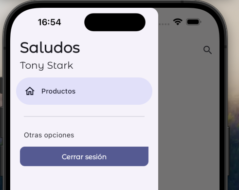

# teslo-app

Este es un proyecto para trabajar con:

- Cámara
- Tokens de acceso
- CRUD (Create Read Update Delete) Rest API Endpoints
- Riverpod
- GoRouter

**1**

Vamos a hacer un login que se puede usar en la vida real.

Esta sección principalmente se enfoca en:

- Realizar el POST HTTP
- Obtener las credenciales del usuario
- Manejo de errores personalizados
- Manejo del estado del formulario con Riverpod
- Comunicación entre providers
- Entre otras cosas

Esta sección empieza a dejar las bases de la autenticación mediante JWT (Json Web Tokens) el cual es un estándar hoy en día y probablemente lo terminarán utilizando en la vida real.

De nuevo, mi objetivo es tratar de enseñarles lo más apegado a la realidad posible, para que la experiencia les sirva tanto como para aprender Flutter, como para mejorar sus habilidades como desarrolladores en general.

**2**

Esta sección está dedicada a la protección de rutas utilizando Go_Router + Riverpod, puntualmente veremos:

- Proteger rutas
- Redireccionar
- Actualizar instancia del GoRouter cuando hay cambios en el estado
- Colocar listeners de GoRouter
- Change notifier
- Preferencias de usuario
- Almacenar token de acceso de forma permanente

La sección es relativamente corta, pero expandimos temas para el manejo del usuario y tokens de acceso de forma persistente.

**3**

En esta sección realizaremos lo siguiente:

- Mejorar el mecanismo de Login (Botón de login automático)
- Masonry ListView
- Productos
  - Entidad
  - Datasources
  - Repositorios
- Riverpod
  - Provider
  - StateNotifierProvider

Al final, tendremos la pantalla funcionando como la vieron en el video anterior y prepararemos el espacio para la siguiente sección donde le daremos un mantenimiento a nuestros productos.

**4**

Esta sección está dedicada a la creación y mantenimiento de productos. Puntualmente:

- Formularios
- Segmentos de botones
- Selectores
- Posteos
  - Path
  - Post
- Retroalimentación de sucesos
- Manejo de errores
- Inputs personalizados
- Y todo lo relacionado al mantenimiento de producto

Importante:

La parte de la cámara y galería de imágenes, es algo que veremos en la siguiente sección.

## Inicio de la aplicación

En este caso, en vez de partir de puro cero, descargamos un proyecto inicializado de la ruta: `https://github.com/Klerith/flutter-authenticated-crud/tree/01-basic-ui`

Al llevarnos este directorio a VSCode nos indicará si queremos instalar las dependencias (Run `pub get`). Indicamos que
Si.

Por ahora, vamos a hacer el desarrollo para Android, porque vamos a ver algunos problemas que vamos a tener con ciertas direcciones.

Indicar que tenemos ciertos `assets` y una carpeta `google-fonts` que, en principio debería estar dentro de assets, pero que se recomienda que esté fuera.

Dentro de la carpeta `lib` vemos una segunda forma de trabajar. Tenemos la carpeta `config` con configuraciones globales, y una carpeta de `features` con carpetas que agrupan características por funcionalidad. Tenemos todo lo de la autenticación en la carpeta `auth` y todo lo de productos en la carpeta `products` y lo que no depende por entero de ninguno lo tenemos en la carpeta `shared`.

Para el uso de Custom Painter ver: `https://www.youtube.com/watch?v=GpxkQegspCk`

## Levantar el backend

Seguir los pasos de ejecución de la parte backend: `teslo-shop-backend`.

Si vemos ese proyecto, vemos que falta el `restart: always` en la parte de `nest-app`. Está hecho a conciencia para ir a Docker de vez en cuando a levantarlo.

Probar con Postman (los scripts están en el proyecto `teslo-shop-backend`) que se puede hacer login.

## Riverpod - Inputs y LoginState

Vamos a dejar los inputs de una manera bien general para poder reutilizarlos. Por eso, en la carpeta `features/shared` creamos la carpeta `infrastructure` y dentro otro directorio llamado `inputs`. Dentro crearemos el archivo de barril `input.dart` y los archivos `email.dart` y `password.dart`.

Hemos instalado, usando `Pubspec Assist` los paquetes: `formz, flutter_riverpod`.

Ahora vamos a la parte de autenticación. En la carpeta `features/auth/presentation` creamos la carpeta `providers` ya que vamos a trabajar con Riverpod, que trabaja en base a providers. Vamos a hacer los pasos iniciales de como quiero trabajar el estado de login. Creamos el archivo provider `login_form_provider.dart` y el archivo de barril `providers.dart`.

Ver: `https://pub.dev/packages/riverpod` y `https://riverpod.dev/docs/introduction/getting_started`

## LoginForm Provider y Notifier

Nos hemos instalado en VSCode, siguiendo la documentación `https://riverpod.dev/docs/introduction/getting_started#going-further-installing-code-snippets`, el plugin de VSCode `Flutter Riverpod Snippets`.

Con esto, en el fuente `login_form_provider.dart`, solo escribiendo `stateNotifier` se genera automáticamente un StateNotifier. Y, solo escribiendo `stateNotifierProvider` se genera el código del Notifier Provider automáticamente.

## Conectar formulario con Provider

Conectamos el Provider al formulario `features/auth/presentation/screens/login_screen.dart`.

## Cambiar el estilo del error

Corregimos como se ve el error en `features/shared/widgets/custom_text_form_field.dart`.

## Riverpod - Inputs, RegisterState, RegisterForm Provider y Notifier y conectar formulario con Provider

En el curso, esto se ha dejado como tarea. Consiste en hacer el provider para la creación de usuario.

En la carpeta `features/shared/inputs` se crean los inputs `username.dart` y `repeat_password.dart`. Este último tiene en cuenta la contraseña que se indicó y la que se repite, para ver si son la misma.

En la carpeta `features/auth/presentation/providers` creo el archivo provider `register_form_provider.dart`.

Luego conectamos el Provider al formulario `features/auth/presentation/screens/register_screen.dart`.

En la carpeta `lib/config` creamos la carpeta `constants` y dentro el archivo `environment.dart`.

## Variables de entorno

https://pub.dev/packages/flutter_dotenv

En la raiz del proyecto nos creamos dos archivos, `.env` y `.env.template`.

Añadimos también la dependencia `flutter_dotenv` usando `Pubspec Assist`.

No olvidar configurar también `pubspec.yaml` y `main.dart`.

Detener la aplicación y volver a ejecutarla. El objetivo de esto es que el nuevo asset vaya al dispositivo físico.

## Auth - Repositorio y Datasource

En la carpeta `lib/features/auth` nos creamos dos carpetas, `domain` e `infrastructure`.

En `domain` creamos la carpeta `datasources` y dentro el archivo `auth_datasource.dart`.

También en `domain` creamos la carpeta `repositories` y dentro el archivo `auth_repository.dart`.

Y de nuevo en `domain` creamos la carpeta `entities` y dentro el archivo `user.dart`.

Por último, en `domain` creamos el archivo de barril `domain.dart`.

En la carpeta `infrastructure` creamos las carpetas `datasources`, `mappers` y `repositories`.

En `infrastructure/datasources` creamos el archivo `auth_datasource_impl.dart`.

En `infrastructure/repositories` creamos el archivo `auth_repository_impl.dart`.

Por último, en `infrastructure` creamos el archivo de barril `infrastructure.dart`.

## Implementación del AuthDataSource - Login

Como necesitamos hacer peticiones http, usaremos el paquete `dio`. Lo instalamos con `Pubspec Assist`.

En la carpeta `lib/features/auth/infrastructure/mappers` creamos el mapper `user_mapper.dart`.

Para gestionar errores personalizados, creamos en `lib/features/auth/infrastructure` la carpeta `errors` y dentro el archivo `auth_errors.dart`.

## Auth Provider

Este Provider nos va a permitir mantener el estado de la autenticación de manera global.

En `lib/features/auth/presentation/providers` creamos un nuevo provider `auth_provider.dart`.

## Login y Logout desde el provider

## Obtener el Token de acceso

Ya podemos hacer la petición al backend (no olvidar ejecutarlo en Docker)

Hay dos eslabones que tenemos que conectar, el `auth_provider.dart` que tiene la implementación de nuestro repositorio el cual se conecta al datasource (tiene las implementaciones y conexiones necesarias) y nos permite llegar a nuestro backend.

Por tanto, el provider llama al repositorio y este al datasource. De esta manera, si luego tenemos que hacer cambios, es más fácil.

Luego tenemos `login_form_provider.dart`, que tiene el `loginFormNotifier` que controla cuando cambia el email, el password y, si todo está bien, vamos a llamar al método de `auth_provider` llamado `loginUser()`.

Una vez hechos los cambios, probamos con un suario correcto `test1@google.com` con password `Abc123`.

Si probamos obtenemos un `Connection refused` (en un simulador de iOS probablemente funciona, pero no en uno de Android, de ahí que es buena idea probarlo en el simulador de Android, para ver este error)

Esto error aparece porque estamos mandado llamar `localhost` directamente en el emulador de Android. En este emulador, localhost apunta al mismo emulador, por lo que no tenemos ningún servicio que corra en el puerto 3001.

Para solucionar esto, tanto en Android como, aunque ya funcione sin esto, en iOS, tenemos que apuntar a la IP de la máquina donde está el servicio (en la imagen de Docker) Para obtener la IP ir a los Settings del Wi-Fi del Mac.

Con esta IP vamos a las variables de entorno `.env` y sustituimos localhost por dicha IP.

Bajamos y volvemos a subir la aplicación. Volvemos a escribir las credenciales correctas y ya nos funciona.

Si ponemos unas credenciales erróneas veremos que caemos en WrongCredentials aunque no siempre va a ser ese tipo de error.

Vamos a leer la response, el `message` o el `statusCode`

## Manejo de errores

En `auth_datasource.impl.dart`, método `login()`, cuando ocurre un error siempre devolvemos `WrongCredentials()`, pero esto no es siempre correcto, ya que puede haber errores de timeout, el móvil puede estar en modo avión, o no tener Internet...

Hay varias maneras de manejar los errores y las estamos manejando en `auth_errors.dart`.

De nuevo en `auth_provider.dart` también mejoramos la gestión de los errores.

## Mostrar el error en pantalla

Podemos mostrar el error al usuario modificando `login_screen.dart`, escuchando los cambios en nuestro `authProvider`, ya que en la función `logout()` tenemos nuestro `errorMessage`.

Al final se han reducido el número de clases personalizadas que se usan para los errores.

## Parte de Registro de nuevo usuario

Modificamos: `auth_datasource.impl.dart`, `auth_provider.dart`, `register_form_provider.dart` y `register_screen.dart`

## Inicio GoRouter + Riverpod

Esta parte la voy a ejecutar en un emulador de iOS.

Vamos a hacer un ajuste para un problema que puede producirse en terminales pequeños. Al pulsar para crear una cuenta, no se ve todo el contenido en la pantalla. Para corregir esto, modificamos `register_screen.dart`.

## Preferencias de usuario - Shared Preferences

https://pub.dev/packages/shared_preferences

Con el paquete `shared_preferences` podemos grabar datos en el dispositivo del tipo tokens... Es muy utilizado, fácil de utilizar y funciona para todas las plataformas.

Indicar que la lectura de la data es síncrona y que cada uno de los valores que leemos puede ser nulo.

Instalamos el paquete usando `Pubspec Assist`.

Vamos a aplicar el patrón adaptador al igual que hicimos con dotenv (fuente `environment.dart`)

Como solo vamos a necesitar tres métodos (leer, escribir y borrar), no vamos a crear carpetas domain e instrastructure, sino un wrapper.

Dentro de `features/shared/infrastructure` creamos la carpeta `services` y dentro dos archivos, el primero `key_value_storage_service.dart` y el segundo, su implementación, lo vemos en la siguiente clase.

## Implementar Patrón Adaptador

Creamos la implementación llamada `key_value_storage_service_impl.dart`.

## Guardar Token en el dispositivo

Vamos a inyectar en `auth_provider.dart` el nuevo servicio `key_value_storage_service_impl.dart`.

## Revisar el estado de la autenticación

Vamos a revisar el estado de la autenticación en el método `checkAuthStatus()` del fuente `auth_provider.dart`.

Modificamos también `auth_datasource_impl.dart`.

## Check Auth Status Screen

Independientemente de si estoy o no autenticado o en el proceso de verificación, vamos a mostrar esta pantalla inicial.

En `features/auth/presentation/screens` creamos el screen `check_auth_status_screen.dart`.

Lo añadimos a nuestro sistema de rutas, que está en `config/router/app_router.dart`.

También se ha hecho que, al pulsar en el botón Cerrar Sesión en `side_menu.dart`, se llame al `logout()` en `auth_provider.dart`.

## Go_Router - Protección de Rutas

Vamos a implementar la protección de rutas de nuestra app. Esto también funciona para Web, móvil, escritorio...

Hay varias formas de implementar esto.

Podemos ir a `app_router.dart`, y, como estamos trabajando con Riverpod, podemos crearnos un Provider que nos regresa la instancia de GoRouter. Al usar el provider, estamos envolviendo nuestro sistema de rutas en un objeto que me permite tener acceso a los diferentes providers.

Otro beneficio es que podemos evitar la construcción de ciertas rutas si no estoy autenticado.

Al hacer este cambio también he tenido que corregir `main.dart` porque ya no tenemos una configuración de Router, sino un Provider que dentro tiene el GoRouter.

## GoRouterNotifier

Seguimos modificando `app_router.dart` para proteger las rutas en función de si estamos o no autenticados.

Necesitamos hacer un ChangeNotifier, así que nos vamos a `config/router` y creamos el archivo `app_router_notifier.dart`.

## Navegar dependiendo de la autenticación

Ya tenemos todo lo que necesitamos para hacer la redirección automática. Vamos a modificar de nuevo `app_router.dart` para ello.

## Bloquear botón de login

Esto se hace para evitar que se pulse más de una vez al botón de Ingresar. Cuando se pulsa una vez y se hace el post, el botón se bloquea para evitar más post.

Modificamos `login_form_provider.dart`, método `onFormSubmit()` para gestionar el estado.

También modificamos `login_screen.dart` para en función del estado, habilitar o deshabilitar el botón.

## Inicio Obtener productos - Datasources y Repositories

## onFieldSubmitted

En la pantalla de login queremos que, al pulsar Intro, se pulse automáticamente el botón Ingresar.

Modificamos `custom_text_form_field.dart` y `login_screen.dart`.

## Entidades, datasources y repositorios

Vamos a preparar nuestra aplicación para poder recibir, manejar y personalizar nuestras interacciones con los productos.

Aquí tendremos las peticiones de los productos.

Todo esto va a requerir un datasource que tendrá que pegarse al mismo endpoint de autenticación.

En `features/products` nos creamos dos directorios, `domain` y `infrastructure`.

Dentro de `domain`, nos creamos tres directorios, `entities`, `datasources` y `repositories`. Recordar que aquí están nuestras reglas del negocio.

Dentro de `entities` creamos la entidad `product.dart`.

Dentro de `datasources` creamos un nuevo datasource `products_datasource.dart`.

Dentro de `repositories` creamos el repositorio `products_repository.dart`.

Por último, dentro de `domain` creamos el archivo de barril `domain.dart`.

Dentro de `infrastructure`, nos creamos dos directorios, `datasources` y `repositories`. Recordar que aquí están nuestras implementaciones.

Dentro de `datasources` creamos un nuevo datasource `products_datasource_impl.dart`.

Dentro de `repositories` creamos el repositorio `products_repository_impl.dart`.

## Product Mapper

En la carpeta `features/products/infrastructure` creamos la carpeta `mappers` y dentro el mapper `product_mapper.dart`.

## Riverpod - Product Repository Provider

En la carpeta `features/products/infrastructure` creamos el archivo de barril `infrastructure.dart`.

En la carpeta `features/products/presentation` creamos la carpeta `providers` y dentro el archivo de barril `providers.dart` y el provider `products_repository_provider.dart`.

## Riverpod - StateNotifierProvider - State, Notifier y Provider

Vamos a crear un nuevo proveedor que me va a servir para llenar todos los productos en una tabla.

En la carpeta `features/products/presentation/providers` creamos un provider `products_provider.dart`.

## Pantalla de productos

Vamos a instalar este paquete: https://pub.dev/packages/flutter_staggered_grid_view

Usamos `Pubspec Assist`

Con este paquete obtenemos el estilo de Masonry para mostrar los productos. Si no quisiéramos instalar nada, se puede conseguir otro efecto distinto usando GridView, con la diferencia de que los elementos aparecen alineados.

Modificamos `products_screen.dart`.

## Tarjetas de producto

En la carpeta `features/products/presentation` creamos la carpeta `widgets` creamos el archivo de barril `widgets.dart` y el widget `product_card.dart`.

También modificamos `products_screen` para que muestre nuestra nueva card.

## Scroll Infinito

Lo implementamos en `products_screen.dart`.

## Pantalla de producto

En la carpeta `features/products/presentation/screens` nos creamos la nueva screen `product_screen.dart` que me va a servir tanto para crear como para actualizar los productos.

En la configuración de Go_Router, `app_router.dart` agregamos una nueva ruta.

Y navegamos a la nueva ruta desde `products_screen.dart`.

Ahora, pulsando sobre cualquier producto, entramos a su screen para edición.

## Inicio Crear y Actualizar Productos

## Product Provider

En la carpeta `features/products/presentation/providers` creamos un provider `product_provider.dart` para manejar la data que fluye con el producto que quiero buscar.

En teoría se podría hacer usando dos providers, uno que me diga cuando está cargando el producto y otro que mantenga la información del producto, ambos con autoDispose, pero vamos a seguir practicando con el StateNotifierProvider.

## Implementar la carga del producto

Modificamos `product_provider.dart` y `product_screen.dart` e implementamos el método `getProductById()` en `products_datasource_impl.dart`.

Nos vamos a crear también un par de clases de excepciones. En `features/products/infrastructure` creamos la carpeta `errors` y dentro el archivo `product_errors.dart`.

## Product Screen - Fix

Al hacer la carga del producto vemos que falla el autoDispose.

El problema es que `product_screen.dart` tiene que ser un ConsumerWidget (sin estado), y se creó como un ConsumerStatefulWidget.

Como solo usamos el provider en ese screen, el initState() y luego ya no es necesario, automáticamente lo destruye (el autoDispose) y luego ya no existe ningún notifier. Ese es el error.

## Diseño de la pantalla

Hay un momento en el tiempo en el que el producto existe y otro momento en el que no existe. En este último momento debemos mostrar un loading a pantalla completa.

Como es algo que no es de productos y que es reutilizable, nos vamos a `features/shared/widgets` y ahí creamos un nuevo widget `full_screen_loader.dart`.

NOTA: Esta carpeta de widgets quizá debiera haber estado en la carpeta `features/shared/presentation/widgets`.

Añadimos también en `features/shared/widgets` el widget `custom_product_field.dart`.

Modificamos `products_screen.dart` para llamar a uno de estos nuevos widgets en función de si está cargando o ya está cargado.

## Campos adicionales de formulario - Formz

Tenemos que hacer la validación de un formulario que es mediano. El backend tiene sus validaciones, y por eso, para que las pase, también el frontend debe tener esas validaciones.

Vamos a crear los campos que necesitamos.

Vamos a `features/shared/infrastructure/inputs` y creamos los archivos de validaciones `title.dart`, `price.dart`, `slug.dart` y `stock.dart`.

## Product Form Provider - State

Estamos en el punto en el que tenemos que preparar la data que queremos enviar al backend con un post.

Solo necesitamos llamar a `dio.post()` mandando la data en el formato que se espera, un `Map<String, dynamic>` y los campos que espera. Si todo va bien obtendremos una response 201 o, si va mal, un 401, 404, 403...

Entonces, vamos a preparar la data que va a fluir a través del formulario. Para ello necesitamos crear un nuevo provider que nos sirva para manejar la data del formulario.

¿Por qué no utilizamos nuestro `productProvider`? Tendría sentido, pero no es lo mismo un producto al formulario de un producto. Aunque la data que se usa del producto sirve para llenar el formulario, no es lo mismo, porque en el formulario necesitamos saber si pasa las reglas de validación y, entre otras cosas, en un formulario puede que no tenga id, pero un producto siempre tiene id.

Incluso aunque se pudiera, es mejor no hacerlo, porque la idea de `productProvider` es proveer información del producto. Ya está, ese es su único objetivo.

En `features/products/presentation/providers` creamos la carpeta `forms` y dentro un provider llamado `product_form_provider.dart`.

Vamos a crear otro StateNotifierProvider porque nos da mucho control, aunque también se podría conseguir el mismo resultado con varios StateProvider pequeñitos.

En esta clase solo hacemos la parte del State del StateNotifierProvider.

## Product Form Provider - Notifier

Seguimos codificando nuestro provider `product_form_provider.dart`, ahora la parte Notifier.

## Product Form Provider - Provider

Seguimos codificando nuestro provider `product_form_provider.dart`, ahora la parte Provider, que será un autoDispose Provider porque cuando salga y regrese quiero que el estado regrese a su estado por defecto, y un family Provider porque necesito recibir el producto (su tipo de dato) para crearlo.

También necesitaremos el callback para poder hacer el submit de la data.

## Testing

Seguir los pasos de ejecución de la parte backend: `teslo-shop-backend`.

Usuario correcto para probar: `test1@google.com` con password: `Abc123`.
