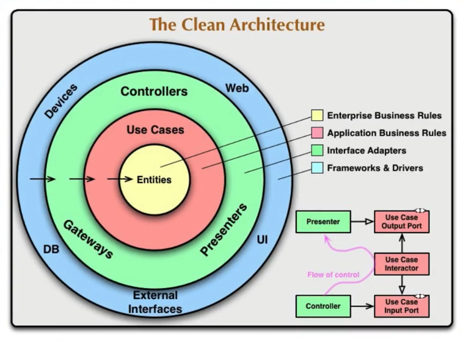

# toktik_con_repositorios

Tal y como se dijo en la app toktik, quedaba preparada para usar repositorios y datasource.

Actualmente nuestra app lee los videos de forma interna, ya que están localizados en una carpeta del proyecto.

Pero sabemos que el día de mañana esos videos no van a venir de esa fuente de datos, sino que posiblemente vengan de algún servicio Http.

Cuando eso ocurra, vamos a tener que ir al Provider y hacer modificaciones. Esto violenta varios principios SOLID, DRY y de Clean Code.

Nosotros tenemos que priorizar que nuestra app no sufra muchos cambios cuando casos como este sucedan en la vida real.

¿Cómo lo conseguimos?

Vamos a usar dos conceptos fundamentales que son parte de una arquitectura limpia:

- DataSource: Lugar de donde vamos a obtener los datos. Puede ser que tengamos datos locales, o que vengan desde una conexión Http, Https, o de distintos URLs...
- Repository: Nosotros no vamos a tratar directamente con los DataSources. Vamos a tener una capa de repositorio que es el que va a hablar con esa fuente de datos. Cuando creamos el repositorio le mandamos la clase abstracta de DataSource y el se encarga de llamar a los métodos que tenga nuestro DataSource. Con esto conseguimos una capa de protección y, si cambia el DataSource, no vamos a tener que cambiar nuestra app.

## Uso de arquitectura limpia

El objetivo de usar una arquitectura limpia no es hacer que nuestra app sea infalible.

A costo de crear más clases, más archivos y más código, vamos a crear diferentes capas que van a impedir que nuestra app sufra cambios, que sea más fácil de modificar y de mantener.

Usando arquitectura limpia, desde los providers se acaba llamando a los casos de uso (usecases), que son las reglas de negocio de la institución.

En este curso no se ven casos de uso. El objetivo de este curso, con respecto a la arquitectura limpia, es dar las bases para que sea más amigable entrar en ella.

¿Cómo sería el flujo de una arquitectura limpia?

1. UI
2. Presentación (gestores de estado, como Provider)
3. Casos de uso
4. Repositorios y datasources
5. Información regresa al UI

Como se ha dicho, en este curso se ven todos los puntos menos el de Casos de uso.

## Creación de proyecto desde VSCode

Se ha copiado el proyecto `toktik` y se le ha dado el nombre `toktik_con_repositorios`.

## Lanzar emulador

- Pulsar Cmd+Shift+P
- Escribir y seleccionar Flutter: Launch Emulator
  - Yo voy a hacer las pruebas con el simulador de iOS
- Estando en el archivo main.dart, volver a pulsar Cmd+Shift+P
- Escribir y seleccionar Flutter: Select Device
- Seleccionar el dispositivo iOS
- Pulsar F5

NOTA: Se recomienda probar esta aplicación en dispositivo físico porque el emulador puede tener ciertos problemas a la hora de reproducir ciertos videos.

## Datasource y Repositorios

Vamos a crear unas clases abstractas que nos van a servir para identificar clases que van a extender o a implementar esas clases abstractas.

A nuestro Provider no le tiene que importar de donde vienen los videos. Al final del día, vengan de donde vengan, lo único que tiene que hacer este Provider es devolver una lista de VideoPost.

Con esta idea, aplicamos también el principio de Responsabilidad Única, por la que la clase DiscoverProvider sólo es responsable de pasar una lista de VideoPost a los Widgets. No tiene que procesarlos ni convertirlos ni mapearlos.

En la carpeta `domain` creamos dos carpetas, `datasources` y `repositories`.

El DataSource indica de dónde vamos a tomar los datos. Al final del día vamos a tener videos locales, videos web, videos del staging y videos que pueden venir de la aplicación de producción. Pero, en el dominio, solo vamos a crear la clase abstracta que va gobernar las implementaciones de los origenes de datos.

Creamos, dentro de `datasources` el archivo `video_posts_datasource.dart`.

Creamos, dentro de `repositories` el archivo `video_posts_repository.dart`.

## Implementaciones

En la carpeta `infrastructure`, a la que en otros sitios también la llaman data, creamos las carpetas `datasources` y `repositories`.

Es aquí donde vamos a realizar las implementaciones de las clases abstractas.

Como ahora mismo solo tenemos videos locales, dentro de `datasources` vamos a crear la implementación `local_video_datasource_impl.dart`.

Si, en algún momento, nuestros videos vinieran de la web, podríamos crear la implementación web_video_datasource_impl.dart, por ejemplo.

En la carpeta `repositories` creamos el archivo de implementación `video_posts_repository_impl.dart`.

Notar que, para el nombre del repositorio, no se hace referencia a si los videos son locales, vienen de la web, etc.

## Usando el repositorio y origen de datos

En la carpeta `providers`, archivo `discover_provider.dart` vamos a llamar a nuestra implementación del repositorio.

En `main.dart` vamos a tener que indicar, en DiscoverProvider, el nombre de la implementación concreta del repositorio y del DataSource.

Es en `main.dart` donde, si cambiamos el DataSource o el Repository, cambiamos eso, sin tener que tocar nada más de la aplicación.
